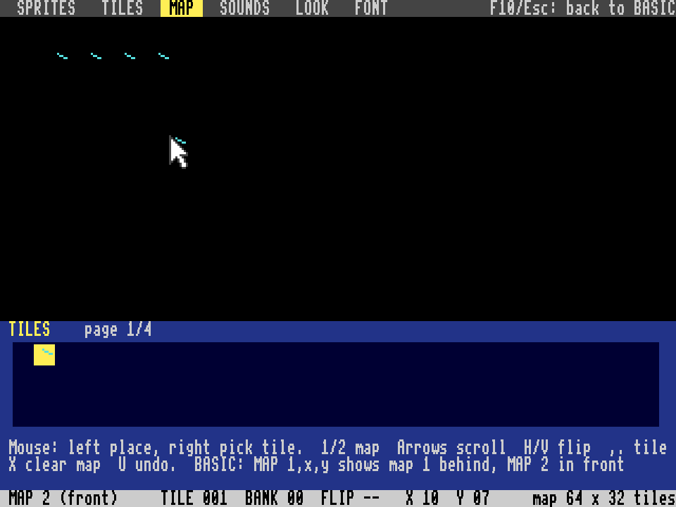

# MERIDIAN 816 – Konzept

Ein Heimcomputer, den es nie gab: irgendwo zwischen Commodore 64 und Amiga.
Er entsteht als FPGA-Core für den MiSTer (DE10-Nano). Die CPU ist ein
fertiger 65C816-Kern, alles drumherum ist Eigenbau.

## Eckdaten

| | C64 | **MERIDIAN 816** | Amiga 500 |
|---|---|---|---|
| CPU | 6510, 1 MHz | **65C816, 8 MHz** | 68000, 7 MHz |
| RAM | 64 KB | **16 MB: 256 KB Chip-RAM + 15,7 MB Zusatzspeicher (SDRAM)** | 512 KB |
| Farben | 16 feste | **256 aus 4096** | 32 aus 4096 |
| Grafik | Text, 2 Bitmap-Modi | **2 Ebenen, je Text 40/80, Kacheln mit Scrolling, Bitmap 16/256 Farben** | Bitplanes |
| Sprites | 8 | **32 × 16x16 (oder 32x32), 16 Farben, keine Grenze pro Zeile** | 8 |
| Spezial | Raster-IRQ | **Copper-Liste, Blitter** | Copper, Blitter |
| Ton | SID, 3 Stimmen | **4 Synthesestimmen + 8 Samplekanäle, Stereo** | Paula, 4 Samples |
| BASIC | Microsoft V2 | **Microsoft 1.1 + MERIDIAN-Befehle für Grafik und Klang** | AmigaBASIC |
| Datenträger | Diskette 170 KB, Modul | **Disketten-/Platten-Images (FAT16), Module bis 4 MB** | Diskette 880 KB |
| Werkzeuge | – | **eingebaut wie beim Pico-8: Sprites, Kacheln, Karten, Klänge, Look, Zeichensatz (F1–F6)** | – |

## MERIDIAN 1.0 – was festgeschrieben ist

Seit MERIDIAN 1.0 dürfen sich Programme auf die folgenden Dinge verlassen.
Spätere Fassungen fügen hinzu, verschieben aber nichts.

- **Version:** `$00:FFE2` Hauptnummer, `$00:FFE3` Nebennummer (1, 0).
  Ältere Kerne haben dort andere Bytes; wer prüfen will, vergleicht beide.
- **Speicherkarte** wie im nächsten Abschnitt, mit allem, was dort dem
  System gehört:
  - Kernseiten `$00:0000–$03FF`, Bildschirm, Zeichensatz `$00:1800`;
  - BASIC `$00:2000–$47FF` und `$00:B800–$BFFF` mit Bank 1;
  - Chips `$00:C000–$CFFF`, die ROMs;
  - Kern im Chip-RAM `$03:2C00–$03:3FFF`, Werkstatt `$03:4000–$03:7FFF`;
  - im Zusatzspeicher: Ablage `$10`, Werkstatt `$F8–$FC`, DRAHT `$FD`,
    Systembank `$FE`;
  - Module `$40–$7F`.
- **Register** aller Chips wie hier beschrieben. Was frei ist, bleibt für
  später reserviert und liest wie bisher.
- **Einsprünge:**
  - Kern `$00:FF80–$FF98` (JSR) und `$00:FFC1–$FFDF` (lang);
  - BASIC-Brücken ab `$00:FFA0`;
  - System-ROM `$FF:4000–$4018`;
  - SONG `$FF:8000–$8008`;
  - Werkstatt `$FF:C000–$C00C`.
- **BASIC:** Die Token-Nummern bleiben; neue Wörter kommen hinten dazu.
  Programme auf Diskette laufen deshalb auch auf späteren Fassungen.
- **Dateiformate:** MER (16-Byte-Kopf), BAS (mit Werkstatt-Anhang `MWS1`),
  TAK (TAKTSTOCK), Images als FAT16.
- **Startzustand:** Jedes Programm, das per Fernstart oder nach einem
  Maschinenprogramm kommt, findet die Anzeige wie nach dem Einschalten vor
  (`anzeige_zuruecksetzen`):
  - Startpalette, Text 40 oder 80 Zeichen, Ebene B aus;
  - PINSEL-Look aus, LOTSE und KRAN angehalten, Sprites aus;
  - keine Karten, keine Klänge.

  Ein Fernstart wartet, bis ein laufender DOS-Aufruf fertig ist.

## Die Chips

| Name | Aufgabe | Stand |
|---|---|---|
| **P65C816** | CPU (fremder Kern, GPL-3) | läuft, ein Fehler behoben |
| **PINSEL** | Grafik | 2 Ebenen × (Text, Kacheln, Bitmap 16, Bitmap 256), Palette 256 aus 4096, Raster-IRQ |
| **PFORTE** | Ein-/Ausgabe: Tastatur, Joysticks, Maus, Timer, Uhrzeit | Tastatur-Puffer, 2 Joysticks, Maus, 2 Timer, µs-Uhr, Kalenderuhr (Etappe 11) |
| **BOTE** | Programmlader: MiSTer-Menü und Netz (DDR3-Postfach), DMA, Fernstart | Etappe 3 |
| **KOBOLD** | Sprites (Teil von PINSEL): 32 × 16×16, eigener Musterspeicher, Kollisionen | Etappe 5 |
| **ORGEL** | Ton: 4 Synthesestimmen mit SID-Seele + 8 Samplekanäle mit Paula-Seele (seit Etappe 17; anfangs 4), Stereo, Filter, Echo | Etappe 6 |
| **KRAN** | Blitter: Rechtecke kopieren, füllen, mit Durchsicht kopieren; Auftragslisten | Etappe 7 |
| **LOTSE** | Copper: fährt mit dem Strahl, setzt Register zeilen- und punktgenau | Etappe 7 |
| **ZUSATZ** | SDRAM-Steuerung: 15,7 MB Zusatzspeicher in den Bänken `$04–$FE` | Etappe 8 |
| **TRUHE** | Laufwerke: drei Images auf der SD-Karte des MiSTer als Blockgeräte (512 Byte), dazu das DOS im ROM | Etappe 10 |
| **DRAHT** | Fenster ins DDR3 (Bank `$FD`), Postfach zum Netzdienst auf dem Linux-Teil des MiSTer | Etappe 12 |

## Takt

- Systemtakt **24 MHz** aus der PLL.
- CPU: jeder dritte Takt ein Buszyklus → **8 MHz**. Die CPU legt die Adresse
  an, das RAM liest im nächsten Takt, im dritten übernimmt die CPU das Byte.
  Schreibzugriffe passieren genau am CPU-Takt.
- Bild: jeder zweite Takt ein Punkt → **12 MHz Punkttakt**, 764 Punkte pro
  Zeile → **15,71 kHz**, 262 Zeilen → **59,95 Hz** (NTSC) bzw. 312 Zeilen →
  **50,3 Hz** (PAL). Sichtbar 640 × 240 Punkte. Über HDMI gibt der MiSTer
  trotzdem seine eigene Bildrate aus (meist 60 Hz), solange in der
  `MiSTer.ini` nicht `vsync_adjust=1` oder `2` steht – dann folgt er dem
  Core, wenn das Display 50 Hz kann.

- ZUSATZ (SDRAM): **48 MHz** aus derselben PLL, phasengleich zum Systemtakt.

Warum nicht schneller? Die CPU-Logik muss zwischen zwei Systemtakten fertig
werden. Bei 24 MHz hat sie 41,7 ns, bei 48 MHz nur 20,8 ns.

## Speicherkarte (CPU-Sicht)

| Adresse | Inhalt |
|---|---|
| `$00:0000–$00:00FF` | direkte Seite: `$00–$0F` BASIC-Brücken, `$10–$54` Kern, `$55–$FF` BASIC |
| `$00:0100–$00:01FF` | Stapel |
| `$00:0200–$00:03FF` | Kern: Tastenpuffer `$0200`, Eingabezeile `$0210`, Kopierstummel `$0270`, logische Zeilen `$0290`, Monitor `$02B0–$02DF` (Variablen, Register-Abzug `$02C0`), SONG läuft `$02E0`, SHINE und Werkstatt (SAVE, LOAD, MAP) `$02E1–$02F3`, SFX-Abspieler `$02F4–$02FF` (MERIDIAN 1.0), Interrupt-Haken `$0300`; BASIC: Eingabepuffer `$0310`, Grafikwerte `$0380`; Kern: DOS arbeitet `$0388`, Fernstart wartet `$0389` (MERIDIAN 1.0) |
| `$00:0400–$00:0D9F` | Bildschirmspeicher (40×30 Zellen à 2 Byte; 80 Zeichen bis `$00:16BF`) |
| `$00:16C0–$00:16FF` | Parameterblock des DOS (siehe DOS) |
| `$00:1700–$00:17FF` | direkte Seite des DOS (`$00–$69`), von MUSIK (`$80–$BF` je Stimme 16 Byte, `$F0–$FE`) und NETZ (`$C0–$C7`); Monitor: Ausgabezeile `$17C8–$17EF`, drei Bytes ab `$176A` |
| `$00:1800–$00:1FFF` | Zeichensatz (vom Kern aus dem ROM kopiert) |
| `$00:2000–$00:BFFF` | frei (Programme laden üblicherweise nach `$2000`); mit BASIC: BASIC-Code `$2000–$47FF` (aus dem ROM kopiert), `$4800–$B7FF` frei für Maschinenprogramme, BASIC-Erweiterung `$B800–$BFFF` (Etappe 13, nur in Bank 0) |
| `$00:C000–$00:C0FF` | PINSEL |
| `$00:C100–$00:C1FF` | PFORTE |
| `$00:C200–$00:C2FF` | BOTE |
| `$00:C300–$00:C3FF` | KOBOLD: Sprite-Tabelle |
| `$00:C400–$00:C4FF` | KOBOLD: Steuerung |
| `$00:C500–$00:C5FF` | ORGEL |
| `$00:C600–$00:C6FF` | KRAN (Blitter) |
| `$00:C700–$00:C7FF` | LOTSE (Copper) |
| `$00:C800` | SYSTEM: Bit 0 SPIEGEL, Bit 1/2 SCHRITT (siehe unten) |
| `$00:C900–$00:C9FF` | TRUHE: Register |
| `$00:CA00–$00:CBFF` | TRUHE: Puffer (ein Block, 512 Byte) |
| `$00:CC00–$00:CCFF` | ORGEL, Seite 2: Samplekanäle 4–7 (Etappe 17) |
| `$00:C801–$00:CFFF` | sonst: weitere Chips (liest `$FF`) |
| `$00:D000–$00:FFFF` | Kern-ROM, Version `$FFE2/$FFE3`, Vektoren ab `$FFE4` |
| `$01:0000–$01:FFFF` | RAM Bank 1; mit BASIC: Datenbank (Kopie des BASIC-Codes `$2000–$47FF`, Programm, Variablen und Zeichenketten `$4800–$FFFF`) |
| `$02:0000–$03:FFFF` | RAM Bänke 2–3 (Grafikdaten). Mit BASIC: Grafik `$02:0000–$03:2BFF`, GRADIENT-Tabelle `$03:2C00`, Copper-Liste `$03:2E00–$03:3D03`, Kern: gedrückte Tasten `$03:3E00–$03:3EFF` und Treffer `$03:3F00` (Etappe 11), Werkstatt: 256 Kacheln `$03:4000–$03:5FFF` und die Karten 1 und 2 `$03:6000–$03:7FFF` (MERIDIAN 1.0), frei ab `$03:8000` |
| `$04:0000–$FE:FFFF` | Zusatzspeicher (SDRAM), 250 Bänke = 15,6 MB (ohne `$FD`); BASIC legt SAVE ohne Namen in Bank `$10` ab; die Werkstatt nutzt `$F8–$FC` (siehe Werkstatt) |
| `$FD:0000–$FD:FFFF` | DRAHT: 64 KB DDR3 (physisch `$3E100000`), nur für die CPU; Postfach zum Netzdienst (Etappe 12) |
| `$40:0000–$7F:FFFF` | Modul (ROM-Abbild, bis 4 MB); steckt eins, ist der Bereich für CPU und KRAN schreibgeschützt |
| `$FE:0000–$FE:FFFF` | Systembank: FAT-Puffer des DOS (`$FE:0000`; ohne SDRAM-Modul `$03:FE00`), Notentexte für PLAY (`$FE:1000–$FE:13FF`), Glanzpunkte von SHINE (`$FE:1400–$FE:1450`) |
| `$FF:0000–$FF:3FFF` | BASIC-ROM (16 KB) |
| `$FF:4000–$FF:7FFF` | System-ROM (16 KB, bis Etappe 12 „DOS-ROM“): DOS (`JSL $FF4000`), MUSIK für PLAY (`$FF4003`, `$FF4006`), NETZ für NET (`$FF4009`), Monitor (`$FF400C`–`$FF4018`, Etappe 13) |
| `$FF:8000–$FF:BFFF` | SONG-ROM (16 KB, MERIDIAN 1.0): der Abspieler von TAKTSTOCK für BASIC `SONG` – Befehl `$FF8000`, Takt `$FF8004`, Funktion `$FF8008` (`rom/song.asm`) |
| `$FF:C000–$FF:FFFF` | Werkstatt-ROM (16 KB, MERIDIAN 1.0): die Werkzeuge am Gerät – Start `$FFC000`, SAVE `$FFC004`, LOAD `$FFC008`, BASIC `MAP`/`TILE` `$FFC00C` (`rom/werkstatt.asm`) |

PINSEL liest das Chip-RAM über einen eigenen zweiten Port: Grafik und CPU
kommen sich nie in die Quere (beim C64 musste die CPU warten, „Badlines“).
**Speicherverwalter (Port A):** Die CPU liest das RAM zum Ende des zweiten
ihrer drei Systemtakte und schreibt zum Ende des dritten. Jeder andere Takt
gehört den DMA-Kunden, nach Vorrang: LOTSE (Befehle holen), ORGEL
(Samples), KRAN (Blöcke). Der erste Takt ist immer frei, der zweite, wenn die
CPU gerade nicht aus dem RAM liest, der dritte, wenn sie nicht ins RAM
schreibt. Die CPU wird nie gebremst.

**SYSTEM `$00:C800`, Bit 0 SPIEGEL:** Bank 1 zeigt in `$0000–$1FFF` dieselben
Bytes wie Bank 0 – Zeropage, Stapel, Kernseiten, Bildschirm. Gedacht für
Programme, die mit Datenbank 1 arbeiten: Absolute Adressen und 16-Bit-Zeiger
erreichen dann trotzdem Zeropage und Stapel (wie die LowRAM-Spiegelung des
SNES). Gilt nur für die CPU, die Chips sehen die echte Bank 1. Der Kern
schaltet den Spiegel ein, solange BASIC läuft, und aus bei jedem Fernstart
und beim Wechsel in den Monitor.

**SYSTEM Bit 1 SCHRITT, Bit 2 emuliert (Etappe 13):** Einzelschritt für den
Monitor, eine Hilfe in der Hardware. Mit Bit 1 geschrieben wartet SYSTEM auf
den nächsten `RTI`, zählt, was er vom Stapel liest (P, PC und – nativ – PBR;
Bit 2 gesetzt: der `RTI` läuft im Emulationsmodus, ohne PBR), und zieht
während des letzten Lesezugriffs NMI. Die CPU sieht die Flanke zu spät für
den `RTI` selbst und nimmt den NMI nach genau einem Befehl dahinter an –
auch nach Zwei-Takt-Befehlen wie `INX`. Bis dahin hält SYSTEM die IRQs
zurück, sonst landete der Schritt in der Interruptroutine. Lesend sagt
Bit 1, dass der letzte NMI vom Schritt kam (bis zum nächsten Schreiben);
so unterscheidet der Kern ihn vom Fernstart durch BOTE. Der C64 kannte so
etwas nicht – SMON brauchte für seinen Einzelschritt einen Timer-Trick.

## PINSEL – Register ab `$00:C000`

Zwei Ebenen: **A** hinten, **B** vorn. Jede zeigt einen von vier Modi:

| Typ | Modus | Daten | Muster |
|---|---|---|---|
| 0 | aus (Ebene A zeigt dann Farbe 0) | – | – |
| 1 | Text 40 oder 80 Zeichen | Bildschirmspeicher | Zeichensatz |
| 2 | Kacheln 8×8, 16 Farben, Welt 64×32 Kacheln (512×256), Scrolling | Kachelkarte | Kachelmuster |
| 3 | Bitmap 320×240, 16 Farben (4 Bit/Pixel, Palettenbank) | Bild (38 400 Byte) | – |
| 4 | Bitmap 320×240, 256 Farben (8 Bit/Pixel) | Bild (76 800 Byte) | – |

Farbe 0 ist auf Ebene B durchsichtig: Text über einem Bild, zwei Kachelebenen
als Parallaxe.

| Reg | Name | Bedeutung |
|---|---|---|
| `$00` | A_TYP | Modus Ebene A (0–4) |
| `$01` | A_OPT | Bit 0: Text mit 80 Zeichen; Bits 4–7: Palettenbank (Bitmap 16) |
| `$02–$04` | A_DATEN | 24-Bit-Adresse: Bildschirmspeicher / Kachelkarte / Bild |
| `$05–$07` | A_MUSTER | 24-Bit-Adresse: Zeichensatz / Kachelmuster |
| `$08` | PAL_IDX | Palettenindex, zählt nach `PAL_HI` weiter |
| `$09` | PAL_LO | `gggg bbbb` |
| `$0A` | PAL_HI | `---- rrrr`, Schreiben übernimmt den Eintrag |
| `$28–$2A` | – | derselbe Satz noch einmal **für LOTSE** (Befehl FARBE): eigener Index, eigenes Zwischenbyte. So stellen Copper und CPU sich beim Palettenschreiben nicht gegenseitig den Index um (seit 06.10.2026) |
| `$0B` | IRQ_EN | Bit 0: Bildende (Zeile 240), Bit 1: Rasterzeile |
| `$0C` | IRQ_ST | anstehende Ursachen; 1 schreiben löscht |
| `$0D/$0E` | ZEILE | lesen: Rasterzeile; schreiben: Vergleichszeile |
| `$0F` | BILDZÄHLER | zählt jedes Bild |
| `$10/$11` | A_SX | Scrolling X 0–511 (Kacheln) |
| `$12` | A_SY | Scrolling Y 0–255 (Kacheln) |
| `$20–$27` | B_… | Ebene B wie `$00–$07` |
| `$30–$32` | B_SX, B_SY | Ebene B wie `$10–$12` |
| `$34` | TUSCHE | MERIDIAN 1.0: Bit 0 Kontur um Sprites mit Kontur-Bit, Bit 1 Schlagschatten der Sprites mit Schatten-Bit, Bit 2 Schlagschatten von Ebene B |
| `$35` | TINTE | Tuschefarbe der Kontur (Palettenindex; 0 = unsichtbar) |
| `$36/$37` | SCHATTEN_X/Y | Versatz des Schlagschattens: X 0–7, Y 1–7 Zeilen (Vorgabe 2, 2) |
| `$40` | GL_NR | Glanz: Kanal 0–15 für `$41–$4C` |
| `$41` | GL_FARBE | Paletteneintrag, den der Kanal schreibt |
| `$42/$43` | GL_VON/BIS | Zeilen 0–239 |
| `$44–$46` | GL_START | Farbe in Zeile VON: rot, grün, blau je 0–255 |
| `$47–$4C` | GL_SCHRITT | je Anteil 16 Bit (8.8 mit Vorzeichen, unten das Nachkomma-Byte): rot `$47/$48`, grün `$49/$4A`, blau `$4B/$4C` |
| `$4D/$4E` | GL_AN | Bit n = Kanal n an (0–7, 8–15) |
| `$50` | LM_IDX | Leuchten: Gruppe 0–31 der Leuchtmaske |
| `$51` | LM_DATEN | 8 Leuchtbits (Farben LM_IDX·8 … +7, Bit 0 die erste); Schreiben zählt LM_IDX weiter |
| `$52` | LEUCHTEN | Stärke 0–15, 0 = aus |

**PINSEL-Look (MERIDIAN 1.0).** Drei Merkmale, die kein Rechner von damals
hatte; zusammen mit der Palette MERIDIAN-256 geben sie MERIDIAN-Bildern einen
eigenen Look. Nach dem Reset sind alle aus,
der Kern schaltet sie beim Start, beim Fernstart und nach jedem Programm aus
(`anzeige_zuruecksetzen`) – was vorher lief, sieht genauso aus wie bisher.

- **Glanz:** 16 Kanäle. Ein Kanal schreibt in der waagrechten Austastlücke
  vor jeder Zeile y von VON bis BIS die Farbe START + (y − VON) · SCHRITT in
  seinen Paletteneintrag – 8 Bit je Anteil, Verläufe ohne Stufen. Die
  Palette ist dafür intern 24 Bit breit; was die CPU schreibt (4 Bit je
  Anteil), wird wie bisher verdoppelt. Mehrere Kanäle auf derselben Farbe
  mit aneinanderliegenden Zeilen ergeben Verläufe mit Abschnitten; LOTSE
  kann Kanäle unterwegs umstellen. Über HDMI 8 Bit je Anteil, am
  Analogausgang 6.
- **Leuchten:** Je Paletteneintrag ein Leuchtbit. Um Punkte in Leuchtfarben
  legt PINSEL beim Ausgeben einen Lichthof – waagrecht ein Dreieck über ±15
  Punkte (zwei Kastenfilter zu 16 Punkten, nur Additionen), senkrecht 1-2-1
  über die Zeilen y−2 … y: Er sitzt eine Zeile tiefer, weil PINSEL nur eine
  Zeile vorauszeichnet. Der Hof liegt auf den Nachbarn, Leuchtpunkte selbst
  behalten ihre Farbe. Bild und Syncs laufen dafür 20 Punkte später hinaus.
- **Tusche:** Eine Kontur von einem Schirmpunkt in der Tuschefarbe um Sprites
  mit Kontur-Bit (KOBOLD, auch doppelt groß ein Punkt), dazu ein
  Schlagschatten: Sprites mit Schatten-Bit werfen ihn auf beide Ebenen,
  Ebene B (Bit 2) auf Ebene A; wo ein Sprite sichtbar ist, fällt keiner.
  Schatten machen halb so hell. PINSEL merkt sich dafür die letzten acht
  Zeilen (2 Bit je Punkt). Eine Kontur um Ebene B gibt es nicht – sie
  bräuchte die Zeile, die PINSEL noch nicht gezeichnet hat.

**Kachelkarte:** 64×32 Einträge zu 2 Byte: Bits 0–9 Kachelnummer (bis 1024),
Bit 10 spiegeln X, Bit 11 spiegeln Y, Bits 12–15 Palettenbank. **Kachel:**
32 Byte, 8 Zeilen zu 4 Byte, linkes Pixel im oberen Halbbyte. Pixelfarbe =
Bank × 16 + Wert, Wert 0 = durchsichtig.

**Textzelle:** 2 Byte – Zeichencode, dann Farbe (Bits 0–3 Vordergrund,
Bits 4–7 Hintergrund; jeweils Palettenindex 0–15). Auf Ebene B ist Farbe 0
durchsichtig.

**Rasterzeile und Interrupts** wechseln schon zu Beginn der horizontalen
Austastlücke auf die nächste Zeile. Wer dann die Palette ändert, hat rund
10 µs (80 CPU-Takte), bevor die Zeile sichtbar wird. **Ebenenregister**
(Modus, Adressen, Scrolling) wirken ab der nächsten gerenderten Zeile –
gerendert wird immer eine Zeile im Voraus.

**Arbeitsweise:** Während Zeile *n* ausgegeben wird, rendert PINSEL Zeile
*n+1*, erst Ebene A, dann Ebene B darüber, in drei Phasen: Zeichen bzw.
Kachelnummern lesen, Schrift bzw. Muster lesen, Pixel schreiben. Die Lesezugriffe
laufen als Pipeline (ein Byte pro Takt). Zeitbedarf von 1528 Takten pro Zeile:
Text 40 Zeichen ~450, Text 80 ~570, Kacheln ~575, Bitmap ~325 – zwei
Kachelebenen also ~1150. Der Zeilenpuffer hält 320 Einträge zu je zwei
Punkten, damit Grafikpixel in einem Takt doppelt breit geschrieben werden und
Text mit 80 Zeichen trotzdem jeden Punkt einzeln setzen kann.

**Umschalten mitten im Bild – die Adresse zählt ab Zeile 0.** PINSEL rechnet
die Leseadresse jeder Zeile aus der *echten Schirmzeile* y (0–239), nicht ab
der Stelle, an der LOTSE umgeschaltet hat:

| Modus | gelesen wird für Zeile y |
|---|---|
| Text 40 / 80 | DATEN + (y / 8) × 80 bzw. × 160, Schriftzeile y mod 8 |
| Kacheln | DATEN + ((y + SY) mod 256 / 8) × 128 |
| Bitmap 16 | DATEN + y × 160 |
| Bitmap 256 | DATEN + y × 320 |

Wer ab Zeile z ein anderes Bild zeigen will – etwa eine Leiste unter einem
Raumbild –, setzt DATEN deshalb auf *Anfang des Bildes − z × Zeilenbreite*.
Beispiel: Raum als Bitmap 256 ab `$01:0000`, Leiste 320×64 als Bitmap 16 ab
`$02:0000`. LOTSE setzt am Bildanfang A_TYP = 4 und A_DATEN = `$01:0000`, in
der Austastlücke vor Zeile 175 (WARTE 175, `$1FF`) A_TYP = 3 und A_DATEN =
`$02:0000` − 176 × 160 = `$01:9200`. Das wirkt ab Zeile 176, weil PINSEL eine
Zeile vorauszeichnet. Vom Raumbild werden so nur die Zeilen 0–175 gelesen
(56 320 statt 76 800 Byte), die Leiste braucht 10 240. In der Simulation
punktgleich und auf dem MiSTer geprüft (06.10.2026).

## KOBOLD – Sprites, ab `$00:C300`

32 Sprites zu 16×16 Pixeln mit 16 Farben, jeder mit eigener Palettenbank,
spiegelbar, auf Wunsch doppelt groß (32×32), vor oder hinter Ebene B. **Keine
Grenze pro Zeile** – alle 32 dürfen auf derselben Zeile stehen (C64: 8).
Sprite 0 liegt vorn, Sprite 31 hinten.

KOBOLD hat seinen **eigenen Musterspeicher** (16 KB = 128 Muster), 64 Bit
breit: eine ganze Spritezeile pro Takt. Er braucht keine Zugriffe auf das
Chip-RAM und rendert parallel zu den Ebenen in einen eigenen Zeilenpuffer;
bei der Ausgabe wird gemischt.

**Sprite-Tabelle** `$C300 + n·8` (n = 0–31):

| Byte | Inhalt |
|---|---|
| +0/+1 | X (9 Bit), Bildschirm-X = X − 32 |
| +2/+3 | Y (9 Bit), Bildschirm-Y = Y − 32 |
| +4 | Muster 0–127 |
| +5 | Bits 0–3 Palettenbank, 4 spiegeln X, 5 spiegeln Y, 6 hinter Ebene B, 7 doppelt groß |
| +6 | Bit 0: an, Bit 1: Kontur, Bit 2: Schlagschatten (MERIDIAN 1.0; wirken nur mit dem Schalter TUSCHE `$C034`) |

**Steuerung** ab `$C400`:

| Reg | Name | Bedeutung |
|---|---|---|
| `$00/$01` | MADR | Byte-Adresse im Musterspeicher (14 Bit) |
| `$02` | MDATEN | schreiben: Byte ablegen, MADR zählt weiter |
| `$03` | STEUER | Bit 0: Sprites an |
| `$04–$07` | KOLL | Bit n: Sprite n hat einen anderen berührt; Schreiben auf `$04` löscht alle |

**Muster:** 16 Zeilen zu 8 Byte, linkes Pixel im oberen Halbbyte, Wert 0 =
durchsichtig. Farbe = Bank × 16 + Wert.

**Zeitbedarf** pro Zeile: 1 Takt je Sprite zum Prüfen, 2 zum Holen der
Musterzeile, 16 (bzw. 32) zum Malen – höchstens rund 1120 der 1528 Takte,
wenn alle 32 doppelt groß auf einer Zeile stehen. Mit Kontur holt KOBOLD
drei Musterzeilen (die Zeile und ihre Nachbarn auf dem Schirm, 9 Takte) und
malt 18 bzw. 34 Punkte; der Sprite reicht dann eine Zeile höher und tiefer.
Randpunkte decken wie Spritepunkte, zählen aber nicht als Kollision. Alle 32
doppelt groß mit Kontur auf einer Zeile: rund 1380 Takte.

## PFORTE – Register ab `$00:C100`

| Reg | Name | Bedeutung |
|---|---|---|
| `$00` | TASTE | Scancode (PS/2 Satz 2) des ältesten Ereignisses |
| `$01` | TASTINFO | Bit 7: Ereignis vorhanden, Bit 1: erweitert (E0), Bit 0: losgelassen |
| `$02` | WEITER | schreiben: ältestes Ereignis verwerfen |
| `$04` | IRQ_ST | Bit 0: neue Taste, Bit 1: Timer A, Bit 2: Timer B; 1 schreiben löscht |
| `$05` | IRQ_EN | gleiche Bits: Interrupt freigeben |
| `$08/$09` | JOY1 | Bit 0 rechts, 1 links, 2 runter, 3 hoch, 4–9 Feuer A–D, Start, Auswahl |
| `$0A/$0B` | JOY2 | wie JOY1 |
| `$0C` | LAYOUT | Bit 0: Mac-Tastatur (MiSTer-Menü) |
| `$10–$13` | UHR | Mikrosekunden seit dem Start (32 Bit); Schreiben auf `$10` friert den Stand zum Lesen ein |
| `$14/$15` | TIMER A | Schreiben = Startwert, Lesen = Zählerstand |
| `$16` | TA_STEUER | Bit 0: läuft, Bit 1: nur einmal |
| `$18/$19`, `$1A` | TIMER B | wie Timer A |
| `$20/$21` | MAUS_X | Mausposition 0..X_MAX (schreiben setzt sie) |
| `$22/$23` | MAUS_Y | 0..Y_MAX, oben 0 |
| `$24` | MAUS_T | Tasten: Bit 0 links, 1 rechts, 2 Mitte |
| `$25` | MAUS_RAD | Raddrehungen (zählt mit Vorzeichen, nach vorn positiv) |
| `$26/$27`, `$28/$29` | X_MAX, Y_MAX | Grenzen (Vorgabe 319 und 239) |
| `$2A` | MAUS_FEST | schreiben: Position, Tasten, Rad zum Lesen festhalten |
| `$30–$36` | UHR | BCD: Sekunde, Minute, Stunde, Tag, Monat, Jahr (2-stellig), Wochentag (0 = Sonntag); schreiben stellt die Uhr |
| `$37` | UHR_ST | lesen: Bit 0 gestellt; schreiben: Stand festhalten |

Die Timer zählen im Mikrosekundentakt abwärts, laden bei 0 den Startwert neu
und setzen ihr IRQ-Bit (Startwert 9999 = alle 10 ms).

**Maus** (Etappe 11): Der MiSTer liefert PS/2-Pakete (Bewegung als 9-Bit-
Zahl mit Vorzeichen, Y nach oben positiv); PFORTE zählt sie zu einer
Bildschirmposition auf und hält sie in den Grenzen. **Uhr:** Der MiSTer
schickt Datum und Uhrzeit (Ortszeit, BCD) nur einmal beim Start des Cores;
danach zählt PFORTE selbst weiter, mit Kalender bis 2099. Bis sie gestellt
ist, gilt Donnerstag, der 1. Januar 2026.

Puffer für 16 Tastenereignisse. Lesen hat bewusst keine Nebenwirkung: Der
65816 erzeugt bei manchen Adressierungsarten Blindlesezugriffe, die sonst
Tasten verschlucken würden. Die Umsetzung in Zeichen macht das Kern-ROM.

## BOTE – Programmlader, Register ab `$00:C200`

| Reg | Name | Bedeutung |
|---|---|---|
| `$00` | STATUS | Bit 0: neues Programm geladen, Bit 1: Autostart angefordert (1 schreiben löscht), Bit 2: Modul steckt, Bit 3: Modulstart aus (Menü), Bit 7: lädt gerade |
| `$01–$03` | LADE | Ladeadresse |
| `$04–$06` | START | Startadresse |
| `$07` | FLAGS | Bit 0: Autostart |
| `$08–$0A` | LÄNGE | Länge der Daten |
| `$0B` | QUELLE | 1 = MiSTer-Menü, 2 = Netz |

**Ziel:** Bänke `$00–$03` (Chip-RAM, ein Byte je Takt) und `$04–$FE`
(Zusatzspeicher, seit Etappe 9b). In den Zusatzspeicher schreibt BOTE über
ZUSATZ, als Kunde mit Vorrang vor CPU und KRAN, mit gut 6 MB/s; ist ZUSATZ
belegt, wartet er. Bank `$FF` (BASIC-ROM) beschreibt er nicht.

**Zwei Wege ins RAM:**

1. **MiSTer-Menü:** „Load program“ zeigt die `*.MER` in `games/MERIDIAN/`.
   Das Rahmenwerk schickt die Datei Byte für Byte, BOTE schreibt sie ins RAM;
   solange ein Byte für den Zusatzspeicher offen ist, bremst er den MiSTer
   über `ioctl_wait`.
2. **Netz:** `tools/senden.py <MiSTer> programm.mer` schreibt per SSH in ein
   Postfach im DDR3-RAM des MiSTer (physisch `$3E000000`). BOTE schaut alle
   2,7 ms nach. Ist die Folgenummer neu, hält er die CPU an (RDY), kopiert
   per DMA und gibt sie wieder frei. Bei mehreren Dateien wartet `senden.py`
   je nach Größe, bis BOTE fertig sein muss. `<MiSTer>` ist die IP-Adresse
   oder der ssh-Name; angemeldet wird als root. Rohe Binärdateien (etwa aus
   64tass oder ca65) nimmt es auch: `tools/senden.py 192.168.1.50
   programm.bin --lade 2000 --start 2000` baut den MER-Kopf selbst, mit
   Autostart. Läuft ein anderer Core, schreibt es nichts (`/tmp/CORENAME`).

Bei Autostart löst BOTE danach einen **NMI** aus. Das Kern-ROM setzt Stapel,
Interrupts und Haken zurück, meldet „REMOTE START $aaaaaa“ und startet das
Programm per `JSL`. Kehrt es mit `RTL` zurück, erscheint wieder „READY.“.

**Dateiformat MER:** 16 Byte Kopf, dann die Daten.

| Byte | Inhalt |
|---|---|
| 0–3 | `MER` und Version 1 |
| 4–6 | Ladeadresse |
| 7 | Bit 0: Autostart |
| 8–10 | Startadresse |
| 11 | frei |
| 12–15 | Länge der Daten |

**Postfach im DDR3** (64-Bit-Wörter): Wort 0 = Folgenummer (wird als Letztes
geschrieben), Wort 1–2 = MER-Kopf, ab Wort 3 die Daten.

**Module** (Etappe 10) kommen über „Insert cartridge“ (`*.MOD`, Menü-Index 2).
BOTE legt die Datei ohne Kopf ab `$40:0000` in den Zusatzspeicher (bis
4 MB), merkt sich „Modul steckt“ und startet den Rechner neu. Der Merker
übersteht jeden Reset; nur „Eject cartridge“ im Menü löscht ihn (und startet
wieder neu). Programme lädt BOTE nicht in einen steckenden Modulbereich.
Seit dem 10.10.2026 heißt der Eintrag `FSC2`: Das Rahmenwerk merkt sich das
gewählte Modul (`config/MERIDIAN.f2`) und lädt es bei jedem Start des Cores
von selbst; im Dateidialog nimmt „Remove“ es wieder heraus.

## Module

Ein Modul ist ein **ROM-Abbild** wie ein EasyFlash-Modul beim C64: Code und
Daten, die ab `$40:0000` im Zusatzspeicher liegen und dort schreibgeschützt
sind (der Speicherverwalter erledigt Schreibzugriffe von CPU und KRAN, ohne
das SDRAM zu berühren). Beim Einschalten und nach jedem Reset ruft der Kern
das Modul vor dem BASIC auf – außer, im Menü steht „Cartridge start: Off“.

**Kopf** (32 Byte ab `$40:0000`):

| Byte | Inhalt |
|---|---|
| 0–7 | Kennung `MODUL816` |
| 8 | Version 1 |
| 9 | Flags (0) |
| 10–12 | Startadresse |
| 13–15 | frei |
| 16–31 | Name (Latin-1, Rest 0) |

Der Kern meldet „MODUL name“ und springt per `JSL` zur Startadresse –
nativ, Akku 8 / Index 16 Bit, direkte Seite 0, Datenbank 0, Interrupts an.
Kehrt das Modul mit `RTL` zurück, räumt der Kern auf und startet BASIC. Die
Kernroutinen erreicht nur Code in Bank 0 (`JSR`): Ein Modul kopiert seinen
Programmteil deshalb ins Chip-RAM (`MVN #$40,#0`) und holt seine Daten
nach Bedarf aus dem ROM – mit KRAN auch Grafik und Klänge.

**Speicherstand:** Beim Einstecken legt der MiSTer `/saves/MERIDIAN/<modul>.sav`
an und hängt die Datei als TRUHE-Laufwerk 0 ein. Das Modul liest und
schreibt sie blockweise (DOS-Befehle 6 und 7); die Datei wächst beim
Schreiben mit.

Beispiel: `programme/counter.asm` – zählt seine Starts im Speicherstand.
Bauen mit `programme/modul.sh counter`, prüfen mit `tools/modul.py`.

## DRAHT – Fenster ins DDR3, Bank `$FD`

Der MiSTer teilt sein DDR3-RAM zwischen dem Linux-Teil (ARM) und dem FPGA.
DRAHT blendet 64 KB davon (physisch `$3E100000`) als Bank `$FD` in den
Adressraum der CPU ein. Jeder Zugriff geht einzeln ans DDR3 – ohne
Zwischenspeicher, weil die Gegenseite die Daten jederzeit ändert –, die CPU
wartet einige hundert Nanosekunden (RDY). Ein Verteiler teilt den
DDR3-Anschluss zwischen BOTE (Postfach `$3E000000`) und DRAHT, eine
Transaktion zur Zeit. Blitter und BOTE erreichen Bank `$FD` nicht.

**Postfach zum Netzdienst** (Etappe 12): Auf dem Linux-Teil läuft
`tools/draht.py` (in `/media/fat/linux/meridian/`, aufgespielt mit
`tools/drahtdienst.sh`). Er startet mit dem MiSTer (`user-startup.sh`) und
arbeitet nur, solange der MERIDIAN-Core läuft (`/tmp/CORENAME`): Andere
Cores benutzen dasselbe DDR3, und der Dienst lässt es dann in Ruhe. Beim
Laden des Cores gelten alte Reste im Fenster als beantwortet. Jede Anfrage ist ein Wechselspiel: Der MERIDIAN
schreibt Art, Kanal und Text und zuletzt die Anfrage-Nummer; der Dienst
schreibt Status und Antworttext und zuletzt die Antwort-Nummer.

| `$FD:` | |
|---|---|
| `$00` / `$01` | Anfrage-Nr (MERIDIAN) / Antwort-Nr (Dienst) |
| `$02` | Art: 1 Befehl, 2 Zeile holen, 3 Zustand, 4–8 Laufwerk 3 (siehe DOS) |
| `$03` / `$04` | Kanal 0–4 / Länge der Anfrage |
| `$06/$07` | Status (16 Bit mit Vorzeichen) |
| `$08` | Länge der Antwort |
| `$10` | Herzschlag des Dienstes (zählt alle 50 ms) |
| `$100` / `$200` | Anfragetext / Antworttext (je bis 255 Zeichen) |
| `$1000–$FFFF` | Dateidaten für Laufwerk 3 (bis 60 KB je Anfrage, Etappe 14) |

Der MERIDIAN-Teil liegt im ROM von Bank `$FF` (`rom/netz.asm`, `$FF4009`):
Er wartet höchstens 20 s (Befehle) bzw. 3 s, Esc bricht ab; antwortet der
Dienst nicht, steht „NO NETWORK SERVICE“ (Status −99) im Fenster. Der
Dienst übersetzt Unicode in den Zeichensatz des MERIDIAN (Umlaute, ß, °
und § bleiben, der Rest wird ASCII oder fällt weg) und lehnt
Telnet-Verhandlungen ab.

## TRUHE – Laufwerke, Register ab `$00:C900`

Das Rahmenwerk des MiSTer hängt Image-Dateien als Blockgeräte ein (512 Byte
je Block): Laufwerk 0 ist der Speicherstand eines Moduls, Laufwerk 1 und 2
sind „Drive 1“ und „Drive 2“ im Menü (`*.DSK`, `*.IMG`, `*.HDF`). Die
CPU schreibt Laufwerk und Blocknummer, gibt den Befehl und wartet, bis TRUHE
fertig ist. Der Puffer fasst **8 KB = 16 Seiten** zu einem Block; die CPU
sieht die gewählte Seite bei `$00:CA00–$00:CBFF`. Ein Auftrag umfasst bis zu
16 Blöcke und beginnt bei der gewählten Seite.

Warum mehrere Blöcke? Der MiSTer öffnet beschreibbare Images mit `O_SYNC`:
Jeder Auftrag geht sofort fest auf die SD-Karte, gemessen rund 74 ms – ganz
gleich, ob er einen Block umfasst oder fünfzehn.

| Reg | Name | Bedeutung |
|---|---|---|
| `$00` | BEFEHL / STATUS | schreiben: 1 Block lesen, 2 Block schreiben; lesen: Bit 0 arbeitet, Bit 1 Fehler (kein Image, schreibgeschützt) |
| `$01` | LAUFWERK | 0–2 |
| `$02–$05` | BLOCK | Blocknummer (32 Bit) |
| `$06` | EINGELEGT | Bit n: Image in Laufwerk n, Bit 4+n: nur lesen |
| `$07` | WECHSEL | Bit n: Image n neu eingehängt (1 schreiben löscht) |
| `$08–$0B` | BLÖCKE | Größe des Images im gewählten Laufwerk |
| `$0C` | SEITE | Seite des Puffers (0–15): bei `$CA00` sichtbar und erste des nächsten Auftrags |
| `$0D` | ANZAHL | Blöcke je Auftrag (1–16) |

Die Merker EINGELEGT und WECHSEL überstehen jeden Reset (das Rahmenwerk
meldet ein Image nur einmal).

## DOS – Dateien auf den Images, `JSL $FF4000`

Das DOS liegt im DOS-ROM (`rom/dos.asm`, gut 3 KB) und versteht
**FAT16** – ohne Partitionstabelle (wie eine große Diskette) oder in der
ersten Partition –, nur das Hauptverzeichnis, Namen 8.3. Die Images lassen
sich am Mac mit `tools/disk.py` anlegen und füllen und mit macOS einhängen
(`hdiutil attach -imagekey diskimage-class=CRawDiskImage BILD.DSK`).

Aufruf: Parameter in den Block ab `$00:16C0`, Befehl in A, `JSL $FF4000`;
zurück A = Fehler (0 gut). Das DOS arbeitet mit eigener direkter Seite
(`$1700`) und hält während eines Aufrufs einen FAT-Sektor im Zusatzspeicher
(`$FE:0000`, ohne SDRAM-Modul im Chip-RAM bei `$03:FE00`). Seit MERIDIAN 1.0
liest jeder Aufruf ihn frisch – ein geänderter Sektor geht vorher auf die
Diskette. So sieht das DOS ein Image, das inzwischen jemand anders geändert
hat, und der Puffer gehört ihm nur während eines Aufrufs.
Einzelne Sektoren (Bootsektor, FAT, Verzeichnis) laufen über Seite 15 des
TRUHE-Puffers. Die Seiten 0–14 sammeln Daten: Beim Laden liest das DOS 15
Sektoren auf Vorrat, beim Sichern schreibt es bis zu 15 anschließende
Sektoren mit einem Auftrag, `LEEREN` schreibt die Nullen ebenso gebündelt.

| Adresse | Name | |
|---|---|---|
| `$16C0` | D_LW | Laufwerk 0–2, 3 = Ordner (Etappe 14) |
| `$16C1` | D_FEHLER | letzter Fehler |
| `$16C2` | D_MER | SICHERN: 1 = mit MER-Kopf |
| `$16C3` | D_ENDUNG | 3 Zeichen, wenn der Name keine Endung hat |
| `$16C6` | D_TLEN | Länge des Namens |
| `$16C7` | D_TEXT | Name (bis 16 Zeichen) |
| `$16E4` | D_ADR | Adresse (24 Bit) |
| `$16E8` | D_LAENGE | Länge (32 Bit) |
| `$16EC` | D_INDEX | Verzeichnis: nächster Eintrag |
| `$16F4` | D_BLOCK | Blocknummer (32 Bit) |

| A | Befehl | |
|---|---|---|
| 0 | LADEN | Datei nach D_ADR, höchstens D_LAENGE Bytes; MER-Dateien erkennt das DOS am Kopf, D_ADR = `$FFFFFF` nimmt dann die Ladeadresse daraus; zurück D_LAENGE |
| 1 | SICHERN | D_LAENGE Bytes ab D_ADR als Datei; D_MER = 1 schreibt einen MER-Kopf davor |
| 2 | ENTFERNEN | Datei löschen |
| 3 | EINTRAG | nächste Datei ab D_INDEX: Name in D_TEXT, Größe in D_LAENGE; Fehler 2 = keine weitere |
| 4 | FREI | freie Bytes nach D_LAENGE |
| 5 | LEEREN | Image neu anlegen (FAT16, mindestens 3 MB), Name D_TEXT |
| 6 | BLOCK LESEN | Block D_BLOCK roh nach D_ADR (512 Byte, ohne Dateisystem) |
| 7 | BLOCK SCHREIBEN | 512 Byte ab D_ADR als Block D_BLOCK |

**Fehler:** 1 ungültig, 2 nicht gefunden, 3 voll, 4 kein Image (Laufwerk
3: kein Dienst), 5 kein FAT16, 6 schreibgeschützt, 7 Verzeichnis voll, 8 zu
groß, 9 Name nicht 8.3 (erlaubt: A–Z, 0–9, `_`, `-`, `~`).

**Laufwerk 3 – der Ordner `files`** (Etappe 14): Der Netzdienst (DRAHT)
stellt den Ordner `games/MERIDIAN/files` der SD-Karte als Laufwerk bereit.
Was dort liegt – per SD-Kartenleser, Netzwerkfreigabe oder FTP
hineinkopiert –, sieht der MERIDIAN sofort, und was er sichert, ist am
Rechner sofort nutzbar: kein Image, kein Einhängen, kein Neu-Einlegen im
Menü. Das DOS reicht LADEN, SICHERN, ENTFERNEN, EINTRAG und FREI für
Laufwerk 3 an `rom/ordner.asm` weiter, das den Dienst über das Fenster
fragt (Art 4–8); die Daten laufen in Stücken bis 60 KB durch `$FD:1000`.
Lange Dateinamen zeigt der Dienst als 8.3-Kürzel (`Space Debris.mod` →
`SPACED~1.MOD`), Groß- und Kleinschreibung spielt keine Rolle. MER-Dateien
liefert er ohne Kopf, mit der Ladeadresse, wie das DOS sonst. Freie Bytes
meldet er höchstens als 99.999.999 (`DIR` zeigt acht Stellen). LEEREN und
die Blockbefehle gibt es auf Laufwerk 3 nicht (Fehler 1). Läuft der Dienst
nicht, kommt nach 10 s Fehler 4.

Datum der Einträge: aus der Uhr von PFORTE (seit Etappe 11); ist sie nicht
gestellt, der 1. Januar 2026.

## ORGEL – Klang, Register ab `$00:C500`

Zwei Welten in einem Chip: vier Synthesestimmen, die sich wie ein SID
anfühlen, und acht Samplekanäle wie bei Paula (bis Etappe 16 vier). Alles läuft im
Mikrosekundentakt (1 MHz) und wird in Stereo gemischt.

**Synthesestimmen** – Stimme n (0–3) ab `$C500 + n·$10`, die ersten sieben
Register in derselben Reihenfolge wie beim SID:

| Versatz | Name | |
|---|---|---|
| `+0/+1` | FREQ | f = FREQ · 1 MHz / 2²⁴ = FREQ · 0,0596 Hz (SID-Notentabellen passen, ~1,5 % höher als PAL) |
| `+2/+3` | PULS | Pulsbreite, 12 Bit |
| `+4` | STEUER | Bit 0 Gate, 1 Sync, 2 Ring, 3 Test, 4 Dreieck, 5 Sägezahn, 6 Puls, 7 Rauschen (kombinierbar) |
| `+5` | AD | Attack (oben) / Decay (unten), SID-Zeittabellen 2 ms – 8 s / 6 ms – 24 s |
| `+6` | SR | Sustain (oben) / Release (unten) |
| `+7` | LAUT | Lautstärke 0–15 (neu gegenüber dem SID) |
| `+8` | PAN | Panorama: links (oben) / rechts (unten), je 0–15; `$FF` Mitte, `$F0` ganz links |
| `+9` | HÜLLE | lesen: Hüllkurve 0–255 |
| `+A` | OSZ | lesen: Wellenform, obere 8 Bit |

Sync und Ring nehmen die vorige Stimme (Stimme 0 die Stimme 3), Rauschen ist
ein 23-Bit-Schieberegister wie im SID, die Hüllkurve klingt exponentiell ab.

**Filter** (Zustandsvariablenfilter, 30 Hz – 12 kHz):

| Register | |
|---|---|
| `$C540/41` | Eckfrequenz, 11 Bit |
| `$C542` | Resonanz (oben, 0–15) / welche Stimmen durchs Filter (unten, Bit n = Stimme n) |
| `$C543` | Bit 4 Tiefpass, 5 Bandpass, 6 Hochpass (kombinierbar); Bits 0–3 Gesamtlautstärke |
| `$C544` | SAMPLEPEGEL n (0–15): die Samplekanäle mal n/4 (Etappe 15; nach dem Einschalten 4) |
| `$C545` | FILTER-ECHO 0–15: Anteil des Filterausgangs am Echo (Etappe 18) |
| `$C546` | FILTER-ZERR 0–15: Verzerrung des Filterausgangs, 0 = aus (Etappe 18) – weich begrenzt wie die Verzerrung der Samplekanäle, aber hinter dem Filter; macht lauter |
| `$C550/51` | ECHO-ZEIT in Abtastwerten zu 32 µs (1–32767, gut eine Sekunde; Etappe 16) |
| `$C552` | ECHO-RÜCKKOPPLUNG 0–15 (n/16) |
| `$C553` | ECHO-ANTEIL 0–15 (n/16), in die Mitte gemischt |
| `$C554` | ECHO-BANK: 64-KB-Puffer ab Bank:0000 im Zusatzspeicher; 0 = Echo aus (nach dem Einschalten) |

**Samplekanäle** – Kanal k (0–3) ab `$C580 + k·$10`, Kanal 4+k (Etappe 17)
mit denselben Versätzen in der zweiten Seite ab `$CC80 + k·$10` (Effekte
dort ab `$CCC0`; der Rest der Seite liest `$FF`):

| Versatz | Name | |
|---|---|---|
| `+0..+2` | START | Adresse (24 Bit): Bänke 0–3 Chip-RAM, ab `$04` Zusatzspeicher (Etappe 15) |
| `+3/+4` | LÄNGE | Bytes (Bits 0–15) |
| `+5/+6` | SCHLEIFE | Rücksprungpunkt ab Start (Bits 0–15) |
| `+7/+8` | SCHRITT | Abspielrate = SCHRITT · 15,26 Hz (22 050 Hz ≙ 1445) |
| `+9` | LAUT | 0–63 |
| `+A` | PAN | wie bei den Stimmen |
| `+B` | STEUER | schreiben: Bit 0 = 1 startet von vorn, 0 hält an; Bit 1 Schleife. Lesen: Bit 0 = spielt |
| `+C/+D` | POS | lesen: Position im Sample (Bits 0–15) |
| `+E` | LÄNGE / POS | schreiben: LÄNGE Bits 16–23 (Etappe 15); lesen: POS Bits 16–23 |
| `+F` | SCHLEIFE | schreiben: SCHLEIFE Bits 16–23 |

**Effekte je Samplekanal** (Etappe 16) – Kanal k ab `$C5C0 + k·$10`, Kette
Crusher → Verzerrung → Lautstärke und Panorama; nach dem Einschalten alles 0:

| Versatz | Name | |
|---|---|---|
| `+0` | BITS | 1–7 Bits behalten (0 = alle 8) |
| `+1` | RATE | jeden Wert n µs halten (0 = aus; 125 = 8 kHz) |
| `+2` | VERZERRUNG | 0–15: mal (4 + 2n)/4, darüber weich begrenzt |
| `+3` | ECHO | Anteil des Kanals am Echo 0–15 |
| `+4` | FILTER | Bit 0: der Kanal läuft durchs Filter (statt trocken, Mitte) |

Das **Echo** ist mono, 16 Bit bei 31,25 kHz, und liegt im Zusatzspeicher: Je
32 µs liest die ORGEL den Wert von vor ZEIT Schritten, schreibt Eingang plus
Echo mal RÜCKKOPPLUNG zurück und mischt das Gelesene mal ANTEIL dazu – mit
Vorrang nach ihren Samples, vor CPU und KRAN, gut 62 000 Zugriffe in der
Sekunde. Nach einem Wechsel von ZEIT oder BANK gilt der Puffer, bis er einmal
ganz beschrieben ist, als still. Ein Programm, das das Echo nutzt, reserviert
dafür 64 KB.

`+3` setzt LÄNGE Bits 16–23 auf 0, `+5` ebenso SCHLEIFE – ältere Programme
merken nichts davon; wer längere Samples spielt, schreibt `+E`/`+F` danach.
Ein Sample darf so bis 16 MB lang sein.

Samples sind 8 Bit mit Vorzeichen. ORGEL holt jedes Byte per DMA aus dem
Chip-RAM in dem Systemtakt, den die CPU nie benutzt (sie liest erst im
dritten). **Aus dem Zusatzspeicher** (Etappe 15) – das konnte Paula mit dem
Fast-RAM des Amiga nie: Dort holt ORGEL je Zugriff ein ganzes Wort, jeder
Kanal merkt es sich und fragt erst für das nächste Wort wieder; am SDRAM
hat sie Vorrang vor CPU und KRAN (nur das Laden durch BOTE geht vor).
Selbst vier Kanäle mit 44 kHz brauchen nur rund 90 000 Zugriffe in der
Sekunde – ein paar Prozent dessen, was das SDRAM schafft. **Pegel:** eine Stimme allein bei voller Lautstärke etwa
−16 dBFS, ein Samplekanal (bei SAMPLEPEGEL 4) mit derselben Spitze; erst
wenn alle acht zugleich ganz oben stehen, greift die Begrenzung. Ein
Synth-Ton hält seine Spitze aber, ein Trommelschlag nur einen Augenblick –
im Mix gehen Samples bei gleicher Spitze unter. Dafür gibt es SAMPLEPEGEL:
8 verdoppelt, 12 verdreifacht die Samplekanäle.

## KRAN – Blitter, Register ab `$00:C600`

Bewegt Rechtecke im Chip-RAM und im Zusatzspeicher, während die CPU
weiterarbeitet. Alle Adressen haben 24 Bit: Bänke `$00–$03` sind Chip-RAM,
ab `$04` Zusatzspeicher – Quelle, Ziel und Auftragsliste dürfen überall
liegen (seit Etappe 9a). Ein Auftrag sind 16 Byte (in den Registern
`$00–$0F` oder in einer Auftragsliste):

| Versatz | Name | |
|---|---|---|
| `$00–$02` | QUELLE | Adresse (24 Bit) |
| `$03–$05` | ZIEL | Adresse |
| `$06/$07` | BREITE | Bytes je Zeile |
| `$08/$09` | HÖHE | Zeilen |
| `$0A/$0B` | Q_ABSTAND | Quelle: von Zeile zu Zeile (16 Bit mit Vorzeichen) |
| `$0C/$0D` | Z_ABSTAND | Ziel: von Zeile zu Zeile |
| `$0E` | WERT | Füllwert bzw. durchsichtiger Farbwert |
| `$0F` | MODUS | Bits 0–1: 0 kopieren, 1 füllen, 2 kopieren ohne Bytes = WERT, 3 kopieren ohne Halbbytes = WERT (Bitmap 16); Bit 2 Zeile rückwärts; Bit 7 letzter Auftrag der Liste |

| Register | |
|---|---|
| `$10` BEFEHL | Bit 0 Auftrag aus den Registern starten, Bit 1 Auftragsliste ab LISTE, Bit 2 abbrechen, Bit 3 Fertig-Meldung löschen |
| `$10` STATUS (lesen) | Bit 0 arbeitet, Bit 1 fertig gemeldet |
| `$11–$13` LISTE | Adresse der Auftragsliste |
| `$14` STEUER | Bit 0 Interrupt, wenn fertig |

Gemessen: füllen 17,6 MB/s, kopieren 8 MB/s; ein Ball mit 16×16 Pixeln und
Durchsicht dauert gut 30 µs.

Mit dem Zusatzspeicher (KRANTEST, je 32 KB, Simulation):

| | µs | MB/s |
|---|---|---|
| Chip → Chip | 4102 | 8,0 |
| Füllen im Zusatzspeicher | 4851 | 6,8 |
| Chip → Zusatz | 4970 | 6,6 |
| Zusatz → Chip | 7233 | 4,5 |
| Zusatz → Zusatz | 8964 | 3,7 |

## LOTSE – Copper, Register ab `$00:C700`

Liest eine Befehlsliste aus dem Chip-RAM, wartet auf Strahlpositionen und
schreibt Register aller Chips außer BOTE. Beginnt jedes Bild neu bei LISTE –
zu Beginn der Austastlücke vor Zeile 240 (unsichtbarer Teil). Er holt Befehle
voraus und schreibt deshalb pixelgenau.

| Befehl (4 Byte) | |
|---|---|
| `$00 – – –` ENDE | bis zum nächsten Bild Ruhe |
| `$01 zl zh xl` WARTE | bis Zeile z (9 Bit), Punkt x (9 Bit, Bit 8 = Bit 1 von zh); x = `$1FF` heißt Zeilenanfang (Austastlücke vor der Zeile) |
| `$02 rl rh w` SETZE | Register `$rhrl` (`$C000–$C7FF`) auf w |
| `$03 al am ah` SPRUNG | weiter bei `$ahamal` |
| `$04 – – –` SIGNAL | Interrupt (wenn in STEUER erlaubt) |
| `$05 – – –` WARTE_KRAN | bis der Blitter fertig ist |
| `$06 n gb r` FARBE | Paletteneintrag n = Farbe (`gggg bbbb`, `---- rrrr`) in einem Befehl, über PINSELs Copper-Satz `$C028–$C02A` (seit 06.10.2026) |

**Farben aus dem Copper nur mit FARBE.** Bis zum 06.10.2026 setzte GRADIENT die Hintergrundfarbe mit drei SETZE auf `PAL_IDX`/`PAL_LO`/`PAL_HI` – denselben Index, den die CPU (BASICs `PALETTE`) benutzt. Fiel eine Copper-Zeile zwischen die drei Schreibzugriffe der CPU, landeten Farben im falschen Eintrag, meist in Weiß (1); gefunden mit NEONFAHRT (Farbzyklus während eines Verlaufs). Eigene Copper-Listen, die per SETZE Farben schreiben, haben das Problem weiterhin – sie sollten FARBE nehmen.

Zeilen in Bildreihenfolge: 240 … letzte Zeile, dann 0 … 239. **Wirkung:**
Die Palette gilt sofort; Ebenen, Scrolling und Sprites ab der nächsten
Zeile, weil PINSEL jede Zeile eine Zeile im Voraus zeichnet.

| Register | |
|---|---|
| `$00–$02` LISTE | Adresse der Befehlsliste (gilt ab dem nächsten Bild) |
| `$03` STEUER | Bit 0 an, Bit 1 SIGNAL-Interrupt erlaubt |
| `$04` STATUS | lesen: Bit 0 Signal gemeldet, 1 läuft, 2 wartet; Bit 0 = 1 schreiben löscht |
| `$05/$06` BEFEHLE | lesen: ausgeführte Befehle im letzten Bild |

## ZUSATZ – Zusatzspeicher (SDRAM)

Das SDRAM-Modul des MiSTer (hier 128 MB) hängt an einer eigenen Steuerung
mit 48 MHz. Die CPU sieht davon 15,7 MB in den Bänken `$04–$FE` – mehr
passt nicht in 24 Adressbits.

- **Lesen** kostet einen Wartezyklus: Die CPU hält über RDY einen Buszyklus
  an (125 ns), bis das Byte da ist.
- **Wortpuffer:** Das SDRAM liefert beim Lesen ein ganzes 16-Bit-Wort; das
  letzte gelesene Wort bleibt stehen. Das andere Byte (oder dasselbe noch
  einmal) kommt sofort – für die CPU ohne Wartezyklus, für KRAN im
  nächsten Takt. Schreibzugriffe auf das Wort ändern den Puffer mit.
- **Zwei Kunden:** CPU und KRAN. Ein Auftrag ist zur Zeit unterwegs, die
  CPU hat Vorrang, KRAN nutzt die Lücken; jeder bekommt nur die Antworten
  auf seine eigenen Lesezugriffe (seit Etappe 9a).
- **Schreiben** kostet nichts: Die Steuerung übernimmt Adresse und Byte und
  schreibt, während die CPU schon weiterarbeitet.
- Zeilen werden für jeden Zugriff geöffnet und mit Auto-Precharge wieder
  geschlossen (ACT – 2 Takte – READ/WRITE, Daten nach CAS-Latenz 2);
  aufgefrischt wird alle 360 Takte (7,5 µs).
- Der SDRAM-Takt ist invertiert (DDR-Ausgang), gelesen wird an der fallenden
  Flanke.
- **Byte-Masken:** Die MiSTer-SDRAM-Module führen DQML/DQMH über die
  Adressleitungen A11/A12 – die Steuerung setzt sie dort beim Schreiben
  (und zusätzlich auf den DQM-Pins).

Gemessen (SPEICHERTEST, 16 KB in 16-Bit-Wörtern): Schreiben gleich schnell
wie im Chip-RAM (19,5 ms), Lesen 6 % langsamer (18,5 statt 17,4 ms; ohne
Wortpuffer 12 %). Alle 251 Bänke ohne einen Fehler.

**Ohne SDRAM-Modul** (MERIDIAN 1.0): Der Kern zählt beim Start die Bänke,
indem er in jeder `$8000` und `$8002` im Wechsel beschreibt und `$8000`
zurückliest. Zwei Stellen, weil ein offener Datenbus den zuletzt
geschriebenen Wert noch eine Weile hält – wer dieselbe Stelle gleich wieder
liest, sähe Speicher, wo keiner ist. Ohne Modul meldet der Start
*256 KB RAM*, und es gilt:
- BASIC, Grafik, Sprites, Ton und Laufwerke laufen; das DOS legt seinen
  FAT-Sektor dann bei `$03:FE00` ab.
- `LOAD` lädt direkt ins Programm, `SAVE` speichert nur das Programm.
- Die Werkstatt öffnet sich nicht (F1–F6 tun nichts). `MAP`, `TILE`, `SFX`,
  `LOOK` und `SAVE`/`LOAD` ohne Namen melden `?NO EXPANSION RAM ERROR`
  (DOS-Fehler 14 des Kerns).
- Was ein Programm selbst in den Zusatzspeicher legt (`BLOAD`, `SAMPLE`,
  `SONG`, Echo), fehlt natürlich.

## Palette MERIDIAN-16 (Startwerte des Kern-ROM)

| # | Farbe | RGB 4-4-4 | | # | Farbe | RGB 4-4-4 |
|---|---|---|---|---|---|---|
| 0 | schwarz | 000 | | 8 | orange | F92 |
| 1 | weiß | FFF | | 9 | braun | 952 |
| 2 | rot | D33 | | 10 | hellrot | F88 |
| 3 | türkis | 5DD | | 11 | dunkelgrau | 444 |
| 4 | violett | A4D | | 12 | grau | 888 |
| 5 | grün | 4C4 | | 13 | hellgrün | 9F9 |
| 6 | blau | 238 | | 14 | hellblau | 8BF |
| 7 | gelb | FE5 | | 15 | hellgrau | CCC |

## Palette MERIDIAN-256 (Farben 16–255, MERIDIAN 1.0)

Die Farben **16–255** belegt der Kern mit **30 Farbfamilien zu 8 Stufen**
(`tools/farben.py`, im ROM `rom/farben.inc`). Familie f liegt ab 16 + 8·f,
Stufe 0 ist die dunkelste. Dunkle Stufen sind Richtung Blauviolett gedreht,
helle Richtung Gelb – so schattieren Pixelkünstler von Hand: Schatten werden
nie grau, Licht nie flach. Eine Palettenbank (16 Farben, Kacheln, Sprites,
Bitmap 16) enthält genau zwei Familien. Bis MERIDIAN 1.0 lag hier ein
Farbkreis aus 240 Tönen.

| | | |
|---|---|---|
| 16 rot | 24 karmin | 32 orange |
| 40 gold | 48 ocker | 56 holz |
| 64 haut | 72 pfirsich | 80 oliv |
| 88 gras | 96 wald | 104 smaragd |
| 112 türkis | 120 petrol | 128 himmel |
| 136 blau | 144 indigo | 152 violett |
| 160 purpur | 168 magenta | 176 grau |
| 184 stein | 192 warmgrau | 200 sand |
| 208 ziegel | 216 lavendel | 224 mint |
| 232 neonpink | 240 neoncyan | 248 neongrün |

Gerechnet in OKLCH, auf 4 Bit je Kanal gerundet. `tools/bild2mer.py`
wandelt Bilder in diese Palette.

## Zeichensatz

256 Zeichen à 8×8, eigener Entwurf (`tools/zeichensatz.py`):
ASCII 32–126 mit Kleinbuchstaben, Umlaute nach Latin-1 (Ä `$C4`, Ö `$D6`,
Ü `$DC`, ß `$DF`, ä `$E4`, ö `$F6`, ü `$FC`), ab `$80` Linien, Blöcke,
Raster, Herz, Ball, Raute, Pfeile; Achtelbalken für Pegelanzeigen:
`$A0–$A6` senkrecht 1/8–7/8 von unten, `$B1–$B8` waagrecht 1/8–8/8 von
links (sechs Pixel hoch).

## Kern-ROM

`rom/kern.asm` (64tass, `rom/bauen.sh` wandelt vorher nach Latin-1).
Konvention: Indexregister immer 16 Bit, Akku 8 Bit, direkte Seite `$0000`,
Datenbank 0.

**Sprungtabelle** (fest, für eigene Programme; Aufruf mit `JSR` aus Bank 0):

| Adresse | Routine | |
|---|---|---|
| `$FF80` | CHROUT | Zeichen in A ausgeben (Steuercodes siehe unten) |
| `$FF83` | GETIN | Taste holen, A = 0 wenn keine |
| `$FF86` | PRINT | Text ab X ausgeben (mit 0 abgeschlossen) |
| `$FF89` | PRDEZ | 16-Bit-Zahl aus `$1A` dezimal |
| `$FF8C` | PRHEX | A als zwei Hexziffern |
| `$FF8F` | LOESCHEN | Bildschirm löschen |
| `$FF92` | MODUS | A = 40 oder 80 Zeichen |
| `$FF95` | KLINGEL | kurzer Ton auf Stimme 4 (wie Steuercode 7) |
| `$FF98` | ORGEL_STILL | ORGEL in den Grundzustand (alles still) |

**Brücken für BASIC** (Aufruf per `JSR` im Emulationsmodus; der Kern
schaltet für die Dauer in den nativen Modus und zurück):

| Adresse | |
|---|---|
| `$FFA0` | Zeichen ausgeben |
| `$FFA3` | logische Zeile (bis 80 Zeichen) in BASICs Eingabepuffer, mit 0 abgeschlossen |
| `$FFA6` | Taste holen, A = 0 wenn keine |
| `$FFA9` | A = 3, wenn Esc gedrückt wurde |
| `$FFAC` | in den Monitor |
| `$FFAF` | MODUS: A = 40/80 |
| `$FFB2` | GRAFIK: A = 0 aus, sonst Bitmap 256 auf Ebene B (Bank 2) an und löschen |
| `$FFB5` | PUNKT: x `$0380` (16 Bit), y `$0382`, Farbe `$0386` |
| `$FFB8` | LINIE: von `$0380/$0382` nach `$0383/$0385`, Farbe `$0386` |
| `$FFBE` | Funktion A (0 MOUSE, 1 JOY, 2 KEY, 3 HIT, 4 CLOCK, 5 NET, 6/7 NET$, 8 SONG, 9 TILE – dessen drei Werte ab `$03A0` wie bei Befehlen), Wert und Ergebnis als 24-Bit-Zahl mit Vorzeichen in `$00–$02` (Etappe 11, `rom/eingabe.asm`) |
| `$FFBB` | Befehl A (0 BLIT, 1 STAMP, 2 SPRITE, 3 PATTERN, 4 SAMPLE, 5 GRADIENT, 6–13 Laufwerke, 14 MOUSE, 15 PLAY, 16 SILENCE, 17 NET, 18 Text zu einem Fehler 2–13: DOS, Schleifen und SONG, 19 SONG, 20 SONG STOP, 21 SHINE, 22 GLOW, 23 INK, 24 MAP, 25 TILE, 26 SFX, 27 LOOK), Werte ab `$03A0` (je 3 Byte), Anzahl in `$039F`; zurück A = 0 gut (Etappe 9c, `rom/befehle.asm`) |

**Lange Einsprünge** für Code im System-ROM (Etappe 13; Aufruf per `JSL`,
zurück mit `RTL`; Akku 8, Index 16 Bit, direkte Seite und Datenbank 0):

| Adresse | |
|---|---|
| `$FFC1` | Zeichen ausgeben |
| `$FFC4` | Taste holen |
| `$FFC7` | MODUS: A = 40/80 |
| `$FFCA` | Anzeige zurücksetzen (nach einem Programm) |
| `$FFCD` | Cursor aus |
| `$FFD0` | A = 3, wenn Esc gedrückt wurde |
| `$FFD3` | Inhaltsverzeichnis (wie `DIR`) |
| `$FFD6` | Text zum Fehler A ausgeben |
| `$FFD9` | (`JML`) zurück ins BASIC |
| `$FFDC` | (`JML`) Hauptschleife: auf Eingaben warten |
| `$FFDF` | (`JML`) `SEC`, `XCE`, `RTI` – ein `RTI` im Emulationsmodus holt die Programmbank nicht vom Stapel, er muss deshalb aus Bank 0 kommen |

**Vektoren:** `BRK` (nativ `$FFE6`, im Emulationsmodus über den IRQ-Vektor
mit gesetztem B-Bit) hält im Monitor an; NMI (`$FFEA`/`$FFFA`) ist entweder
ein Einzelschritt (SYSTEM Bit 1) oder ein Fernstart von BOTE.

**Interrupt-Haken** `$0300` (16 Bit, Bank 0): Der Kern ruft die Routine
bei jedem Interrupt per `JSR` auf, nachdem er das Bildende erledigt hat –
mit A (8 Bit) = PINSEL-IRQ-Status, X/Y 16 Bit, Datenbank 0. Sie quittiert
ihre Quellen selbst und endet mit `RTS`. Programme merken sich den alten
Haken und setzen ihn am Ende zurück. Der Standard-Haken quittiert nur
Rasterzeile und Timer.

**Bildzähler** in `$50–$52` (24 Bit), zählt jedes Bild.

**LOTSE und KRAN** hält der Kern bei jedem Fernstart und Programmende an;
der Standard-Haken quittiert auch ihre Interrupts.

**Klang:** Beim Einschalten spielt der Kern einen Startklang (C4 G4 D5 E5 als
Dreiecke, nacheinander angeschlagen). Bei jedem Fernstart und nach jedem
Programmende schaltet er ORGEL still. `?FEHLER` im Monitor klingelt.

**Steuercodes** (Tasten und CHROUT): `$01` Pos1, `$03` Stopp (Esc),
`$07` Klingel, `$08` Rückschritt, `$0C` Bildschirm löschen (Umschalt+Pos1), `$0D` Return,
`$0E` Einfügen, `$10–$19` Textfarbe 0–9 (Strg+0..9), `$1C` →, `$1D` ←,
`$1E` ↑, `$1F` ↓, `$7F` Entf.

**Tastatur:** deutsches Layout mit Umlauten und ß, AltGr-Zeichen nach PC-
oder Mac-Belegung (Umschalter im MiSTer-Menü). Tastenwiederholung nach
25 Bildern, dann alle 3 Bilder (USB-Tastaturen wiederholen nicht selbst).

**Bildschirmeditor** wie beim C64: Der Cursor fährt frei über den Schirm,
Return übernimmt die Zeile, auf der er steht. Läuft eine Zeile über den
Rand, gehört die Folgezeile dazu (logische Zeile, bis 80 Zeichen); die
Verbindungen stehen in einer Tabelle ab `$0290` und wandern beim Rollen mit.

**Start:** Das Kern-ROM („OS 1.0“) zählt den Speicher (ein Byte je Bank, der alte Inhalt
bleibt; einen steckenden Modulbereich fasst er nicht an), zeigt die
Startmeldung, ruft ein steckendes Modul auf und startet BASIC. Der Monitorbefehl `BASIC` kehrt zurück (Warmstart, das Programm
bleibt erhalten).

**Monitor** (Etappe 13: im Stil von SMON, im System-ROM `rom/monitor.asm`;
der Kern liest nur die Zeile unter dem Cursor und ruft `$FF400C`).
Zahlen hexadezimal, Adressen mit 24 Bit, ein `$` davor ist erlaubt:

| Befehl | |
|---|---|
| `A a [befehl]` | Assembler für den 65C816: übersetzt und zeigt die Zeile disassembliert, darunter wartet `A nächste ` auf den nächsten Befehl; eine leere Eingabe beendet |
| `D [a [e]]` | Disassembler (ohne Ende 16 Zeilen, ohne Anfang weiter, wo er stand) |
| `,a … befehl` | Zeile von `D` ändern: Befehl überschreiben, Return übersetzt neu |
| `M a [e]` | Speicher zeigen (`:aaaaaa xx …` – Zeile ändern und Return schreibt zurück) |
| `:a bb bb …` | Bytes schreiben |
| `R` | Register zeigen: PC, A, X, Y, S, D, Datenbank, P und die Flaggen (groß = gesetzt) |
| `;pc a x y s d db p` | Register ändern (die Zeile von `R` überschreiben) |
| `G a` | Programm per `JSL` starten (mit frischem Stapel), Rückkehr mit `RTL` |
| `G` | mit den Registern weitermachen, wo das Programm stand (nach `BRK` oder Schritt) |
| `W [n]` | n Befehle (Vorgabe 1) im Einzelschritt, jeder mit Disassembly und Registern; Esc hält an |
| `F a e bb` | Bereich füllen |
| `T a e z` | Bereich kopieren (MVN/MVP je nach Richtung) |
| `C a e z` | Bereiche vergleichen, Abweichungen zeigen |
| `H a e bb bb …` / `H a e "text"` | Bytes oder Text suchen |
| `L "name" [a]` | Datei laden (Endung `.MER`, wenn keine; ohne `a` an ihre Ladeadresse) |
| `S "name" a e` | Bereich als MER-Datei sichern |
| `DIR` | Inhaltsverzeichnis (Laufwerk wie im BASIC) |
| `$1F` / `#31` / `%11111` | Zahl umrechnen: hex, dezimal, binär |
| `CHARS` | Zeichentabelle (bis Etappe 12 `C`) |
| `MODE 40` / `MODE 80` | Zeichen pro Zeile |
| `COLOR v h` | Text- und Hintergrundfarbe (0–F) |
| `?` / `HELP` | Übersicht |
| `X` / `BASIC` | zurück ins BASIC |

**Assembler-Schreibweise** (wie der Disassembler sie zeigt): Die Zahl der
Ziffern bestimmt die Größe – `$12` Direktseite, `$1234` absolut, `$123456`
lang; `#$12` ist ein 8-Bit-, `#$1234` ein 16-Bit-Wert. `($12),Y`, `[$12],Y`,
`$12,S`, `($12,S),Y`, `JMP ($1234,X)`, `JML [$1234]`, `MVN $01,$02` (Quelle,
Ziel). Verzweigungen nehmen das Ziel (`BNE $5000`), `JMP`/`JSR` mit sechs
Ziffern werden zu `JML`/`JSL`. Gibt es eine Adressierung nur mit 16 Bit
(`STA $12,Y`), nimmt der Assembler sie. `BRK` hat ein Signaturbyte (zwei
Bytes, `BRK #$00`).

**Breiten beim Disassemblieren:** Ob `LDA #` ein oder zwei Bytes hat, steht
im Prozessor, nicht im Code. `D` verfolgt `REP` und `SEP`; zu Beginn gilt,
was der Assembler zuletzt gesehen hat, der letzte Halt (`BRK`/Schritt) oder
`;` (P). Beim Einschalten: Akku 8, Index 16 Bit – die Regel des Kerns.

**BRK und Einzelschritt:** Ein `BRK` hält das Programm an, der Monitor zeigt
die Register (PC steht hinter dem Signaturbyte) und wartet; `G` macht
weiter, `W` geht Schritt für Schritt. Der Monitor arbeitet dabei unter dem
Stapel des Programms, `G` und `W` stellen alle Register wieder her (`RTI`,
auch im Emulationsmodus). Den Schritt macht die Hardware möglich (SYSTEM
Bit 1): er geht durch jeden Befehl, auch durch ROM-Routinen.

Für Programme und Tests (Aufruf per `JSL`): `$FF4015` disassembliert eine
Zeile ab `[$2C]` in den Puffer `$17C8`, `$FF4018` übersetzt die Zeile in
`$0210` für die Adresse `[$2C]` (C = 1: Fehler). Selbsttest:
`programme/montest.asm` – 2 × 256 Opcodes hin und zurück.

## BASIC

Microsoft BASIC M6502 1.1 von 1978 (Originalquelle, seit 2025 unter
MIT-Lizenz), maschinell aus MACRO-10 nach 64tass übersetzt
(`basic/werkzeuge/m10.py`) und mit geprüften Ersetzungen angepasst
(`basic/werkzeuge/anpassen.py`); die MERIDIAN-Teile stehen in
`basic/meridian.s`. BASIC läuft im **Emulationsmodus** des 65816 – dort ist
er ein 6502 mit 8 MHz – und spricht über die Brücken mit dem Kern.

Gleitkomma mit 9 Stellen (40 Bit), Zeichenketten, Felder, `GET` wartet nicht,
`Esc` bricht ab, `?` steht für `PRINT`. **47 102 Bytes frei** (C64: 38 911).

**Speicher:** BASIC kennt nur 16-Bit-Zeiger. Der Code läuft deshalb in
Bank 0, seine Daten liegen in **Bank 1** – der 65816 holt absolute Adressen
und `(zp),y`-Zeiger aus der Bank im Datenbankregister. In Bank 1 steht eine
Kopie des Codes (für seine Tabellen), ab `$4800` folgen Programm, Variablen
und Zeichenketten bis `$FFFF`. Der Spiegel (SYSTEM) blendet Zeropage, Stapel
und Eingabepuffer aus Bank 0 ein. `basic/werkzeuge/bankpruefung.py` prüft
beim Bauen, dass kein absoluter Zugriff auf Chipregister oder in den Code
übrig ist; die MERIDIAN-Befehle sprechen die Chips mit langer Adresse an.

`PEEK`, `POKE` und `WAIT` nehmen **24-Bit-Adressen** (bis 16 777 215):
Adressen unter 65 536 meinen Bank 0 (Chips, Kern), `PEEK(65536*4)` liest den
Zusatzspeicher. `FRE(0)` zählt ohne Vorzeichen (beim C64 wird es über 32 767
negativ). Maschinenprogramme für `USR` laufen mit Datenbank 1.

| Befehl | |
|---|---|
| `CLS` | Bildschirm löschen |
| `COLOR v[,h]` | Text- und Hintergrundfarbe (0–15) |
| `MODE 40` / `MODE 80` | Zeichen pro Zeile |
| `GRAPHIC 1` / `GRAPHIC 0` | Bitmap 320×240 mit 256 Farben vor dem Text (Farbe 0 durchsichtig) an und löschen / aus |
| `PLOT x,y[,f]` | Punkt setzen |
| `LINE x1,y1,x2,y2[,f]` | Linie ziehen |
| `PALETTE n,r,g,b` | Farbe n neu mischen (Anteile 0–15) |
| `SOUND s,hz[,w]` | Ton auf Stimme 1–4: Frequenz in Hz, Welle 1 Dreieck, 2 Sägezahn, 3 Puls, 4 Rauschen; `hz` = 0 lässt ausklingen |
| `SILENCE` | alle Stimmen aus |
| `PAUSE n` | n Bilder warten (1/60 s) |
| `SAVE` / `LOAD` | ohne Namen: Programm in den Zusatzspeicher (Bank `$10`) und zurück |
| `SAVE "name"[,lw]` / `LOAD "name"[,lw]` | Programm als `NAME.BAS` auf die Diskette und zurück |
| `DIR [lw]` | Inhaltsverzeichnis und freier Platz |
| `BLOAD "name"[,adr[,lw]]` | Datei laden (Endung `.MER`, wenn keine angegeben); MER-Dateien ohne `adr` an ihre Ladeadresse |
| `BSAVE "name",adr,länge[,lw]` | Speicher als MER-Datei sichern (24-Bit-Adressen) |
| `SCRATCH "name"[,lw]` | Datei löschen (Endung `.BAS`, wenn keine angegeben) |
| `HEADER "name"[,lw]` | Diskette neu anlegen – alles darauf ist weg |
| `DRIVE n` | Laufwerk für Befehle ohne `lw` (0–3, Vorgabe 1; 3 = Ordner `files`) |
| `MONITOR` | in den Maschinensprache-Monitor (zurück mit `BASIC`) |
| `BLIT von,nach,länge` | Block kopieren mit KRAN, 24-Bit-Adressen, auch Zusatzspeicher und überlappend |
| `STAMP adr,x,y,b,h` | Bild (b×h Bytes, Farbe 0 durchsichtig) von adr – auch aus dem Zusatzspeicher – in die Grafik |
| `SPRITE n[,x,y[,m[,f]]]` | Sprite n (0–31) bei x,y mit Muster m; f = Palettenbank + 16 spiegeln X + 32 Y + 64 hinter der Grafik + 128 doppelt groß + 256 Kontur + 512 Schlagschatten (mit INK); nur n: aus. Der erste SPRITE nach dem Einschalten oder nach einem Maschinenprogramm leert die Tabelle (Muster, f, an), ohne m/f gilt dann 0 |
| `PATTERN m,z,"…"` | Zeile z (0–15) von Muster m (0–127): 16 Hexziffern, eine je Pixel („.“ = durchsichtig) |
| `SAMPLE k[,adr,länge[,hz[,laut[,schleife]]]]` | Samplekanal k (0–7): 8 Bit mit Vorzeichen, Vorgabe 22 050 Hz und Lautstärke 63; spielt aus dem Chip-RAM oder direkt aus dem Zusatzspeicher, bis 16 MB lang (Etappe 15); nur k: anhalten |
| `GRADIENT z1,r1,g1,b1,z2,r2,g2,b2` | Farbverlauf der Hintergrundfarbe von Zeile z1 bis z2 (Anteile 0–15), LOTSE setzt sie in jeder Zeile; mehrere Verläufe ergänzen sich; ohne Werte: aus |
| `PLAY "noten"[,stimme]` | Musik im Hintergrund auf Stimme 1–4 (Vorgabe 1), siehe unten; leerer Text: Stimme still |
| `SONG "name"[,lw]` / `SONG STOP` | TAKTSTOCK-Song (`NAME.TAK`) laden und im Hintergrund spielen / anhalten (MERIDIAN 1.0), siehe unten |
| `SHINE c,y,r,g,b` | Glanzpunkt: Farbe c hat in Zeile y die Farbe r,g,b (0–15); zwischen den Punkten einer Farbe ein Verlauf ohne Stufen, über dem ersten und unter dem letzten deren Farbe. `SHINE c`: Punkte der Farbe c weg, `SHINE`: alles aus. Höchstens 16 Glanzkanäle (je Farbe Punkte + 1, wenn der erste nicht in Zeile 0 liegt) |
| `GLOW s[,c…]` | Leuchten mit Stärke s (1–15), die Farben c leuchten (bis zu 7 je Befehl, weitere mit dem nächsten GLOW); `GLOW 0` oder `GLOW`: aus, keine Farbe leuchtet mehr |
| `INK c[,dx,dy[,b]]` | Tusche in Farbe c: Kontur um Sprites mit f + 256, Schlagschatten der Sprites mit f + 512 (b = 1: auch der Grafik/Ebene B), versetzt um dx (0–7) und dy (1–7, Vorgabe 2, 2); `INK 0` oder `INK`: aus |
| `MAP l[,x,y]` | Ebene l zeigt Karte l aus der Werkstatt (1 hinten statt des Textes, 2 vorn statt der Grafik, Kachel-Farbe 0 durchsichtig), gerollt um x (0–511) und y (0–255) Punkte; `MAP 0`: aus. Wartet BASIC wieder auf einen Befehl, zeigen die Ebenen von selbst wieder Text und Grafik (MERIDIAN 1.0) |
| `TILE l,x,y,t[,f]` | Feld x (0–63), y (0–31) der Karte l (1/2) bekommt Kachel t (0–255); f = Palettenbank + 16 spiegeln X + 32 Y, ohne f die Bank, in der die Kachel gemalt wurde |
| `SFX n[,v]` | Klang n (0–63) aus der Werkstatt im Hintergrund auf Stimme v (1–4); ohne v auf der ersten freien von 4 abwärts (sonst 4). `SFX -1[,v]`: Stimme v bzw. alle still. Ein Klang nimmt seine Stimme, solange er spielt – PLAY und SONG auf derselben Stimme stören sich (MERIDIAN 1.0) |
| `LOOK [n]` | Look aus der Werkstatt: ihre Palette, leuchtende Farben und Stärke, Tusche und ihr Zeichensatz gelten; `LOOK 0`: Startfarben, kein Leuchten, keine Tusche, Zeichensatz des ROM (MERIDIAN 1.0) |
| `MOUSE 1[,n]` / `MOUSE 0` | Mauszeiger (Pfeil, Sprite n, Vorgabe 0 = ganz vorn) an / aus |
| `NET "befehl"[,k]` | Auftrag an den Netzdienst, Kanal k (0–4), siehe unten |
| `IF b THEN … ELSE …` | Etappe 13: ELSE gilt für das nächste IF davor in derselben Zeile; `IF A THEN 100 ELSE 200` springt |
| `WHILE b` … `WEND` | Schleife, solange b wahr ist (auch über mehrere Zeilen und verschachtelt; ist b gleich falsch, geht es hinter dem passenden WEND weiter) |
| `REPEAT` … `UNTIL b` | Schleife bis b wahr ist (läuft mindestens einmal) |
| `RENUMBER [neu[,schritt[,ab]]]` | Zeilen ab `ab` (Vorgabe: die erste) neu nummerieren: `neu`, `neu+schritt` … (Vorgabe 10, 10), wie beim C128; alle Verweise ziehen mit (`GOTO`, `GOSUB`, `THEN`, `ELSE`, `RUN`, `ON … GOTO/GOSUB`, `GO TO`). Löscht die Variablen. Ein Verweis auf eine Zeile, die es nicht gibt, bricht vorher ab (`?UNDEF'D STATEMENT ERROR IN zeile`), eine unmögliche Reihenfolge mit `?ILLEGAL QUANTITY` |

**Funktionen** (Etappe 11, Ergebnis eine Zahl; wahr = −1):

| Funktion | |
|---|---|
| `MOUSE(n)` | 0 X (0–319), 1 Y (0–239), 2 Tasten (1 links, 2 rechts, 4 Mitte), 3 Rad |
| `JOY(n)` | Joystick 1 oder 2: 1 rechts, 2 links, 4 runter, 8 hoch, 16 Feuer A, 32 B, 64 C, 128 D, 256 Start, 512 Auswahl |
| `KEY(c)` | −1, wenn die Taste mit dem Zeichen c gerade gedrückt ist (Buchstaben groß oder klein, 13 Return, 32 Leertaste, 28–31 Cursor →←↑↓); `KEY(0)`: irgendeine Taste |
| `HIT(n)` | −1, wenn Sprite n seit der letzten Frage einen anderen berührt hat (die Frage löscht nur dieses Bit) |
| `CLOCK(n)` | 0 Bildzähler (1/60 s), 1 Sekunde, 2 Minute, 3 Stunde, 4 Tag, 5 Monat, 6 Jahr, 7 Wochentag (0 = Sonntag) |
| `NET(k)` | k = 0: Status des letzten NET-Befehls (0 gut, HTTP-Code, negativ Fehler); sonst Zeilen, die auf Kanal k warten (0 keine, −1 keine Verbindung, −2 wartet auf einen Anruf) |
| `NET$(k)` | nächste Zeile von Kanal k (leer, wenn keine); `NET$(0)`: Meldung zum letzten Befehl, danach seine weiteren Zeilen |
| `SONG(n)` | 0 Position in der Folge, 1 Zeile (0–63), 2 spielt (1/0) – für Spiele und Demos, die sich nach der Musik richten |
| `TILE(l,x,y)` | Kachel im Feld x,y der Karte l (0 = leer, auch außerhalb der Karte) – für Wände, Böden, Münzen |

**NET** (Etappe 12) – die Arbeit macht der Netzdienst auf dem Linux-Teil des
MiSTer; Fehler hält BASIC nie an, `NET(0)` und `NET$(0)` sagen, was war:

| Befehl | |
|---|---|
| `CONNECT host[:port]` | TCP-Verbindung auf Kanal 1–4 (Port ohne Angabe 23) |
| `LISTEN port` | auf einen Anruf warten (für Chat und Mehrspieler) |
| `SEND text` | eine Zeile senden |
| `CLOSE` | Verbindung schließen |
| `GET url` | Webseite holen (http oder https), ihre Zeilen kommen auf den Kanal |
| `FETCH url [adresse]` | Datei holen und per BOTE in den Speicher laden (MER-Dateien an ihre Adresse, mit Autostart, sonst nach `adresse`) |
| `DISK name [mb]` | neues leeres Diskettenbild auf der SD-Karte (Vorgabe 8 MB) |
| `FILES` | Dateien in `games/MERIDIAN` (Zeilen über `NET$(0)`) |
| `HELP` | Übersicht |

Beispiel: `NET "GET wttr.in/Berlin?format=3":PRINT NET$(0):PRINT NET$(0)`.
Vorführung: `programme/chat.bas`.

**PLAY** spielt im Hintergrund, BASIC läuft weiter; jede Stimme hat ihren
eigenen Text. Groß oder klein, Leerzeichen egal:

| Zeichen | |
|---|---|
| `C D E F G A B` | Note; danach `#` oder `+` höher, `-` tiefer, Länge (1 ganze, 2, 4, 8, 16, 32 …, auch 3, 6, 12) und `.` punktiert |
| `R` | Pause, Länge wie bei Noten |
| `O n`, `<`, `>` | Oktave 0–7 (Anfang 4), eine tiefer, eine höher |
| `L n` | Länge ohne Angabe (Anfang 4 = Viertel) |
| `T n` | Tempo in Vierteln je Minute, 32–255 (Anfang 120) |
| `W n` | Welle 1 Dreieck, 2 Sägezahn, 3 Puls, 4 Rauschen |
| `V n` | Lautstärke 0–15 |
| `!` | von vorn (Endlosschleife) |

Beispiel: `PLAY "T150 W3 O5 L8 CEGEC<G>CE !",1` spielt eine Begleitfigur in
Dauerschleife. Der Kern ruft den Sequenzer in jedem Bild (`rom/musik.asm`);
Zeiten zählen in 1/16 Bildern mit Übertrag, das Tempo bleibt genau.
`SILENCE` hält auch PLAY an.

**SONG** (MERIDIAN 1.0) spielt Songs aus TAKTSTOCK im Hintergrund, mit allem,
was der Tracker kann: acht Spuren (vier Synthstimmen, vier Samplekanäle),
Effekte, Lautstärke-Spalte, Hüllkurven und Synth-Pult. Der Abspieler ist
derselbe wie in TAKTSTOCK und liegt im SONG-ROM; der Kern ruft ihn bei jedem
Interrupt von Timer A (PFORTE) auf – BASIC läuft weiter. Ein Song läuft
endlos (wie im Tracker, ab der Neustart-Position), bis `SONG STOP`,
`SILENCE` oder ein neuer `SONG`; `F00` hält ihn an (`SONG(2)` = 0). Bilder,
Texte und eigener Code der Bildspur bleiben liegen. Eine Datei, die keine
TAKTSTOCK-Datei ist, meldet `?NOT A SONG ERROR`.

Beispiel: `SONG "NEBEL":WHILE SONG(0)<2:WEND:PRINT "TEIL 3"`.

TAKTSTOCK selbst, der Tracker für MERIDIAN, erscheint später. Sein Abspieler
liegt schon im Projekt (`taktstock/spieler.asm`, `taktstock/pult_rechnen.asm`
mit `huelle.inc` und `perioden.inc`), denn das SONG-ROM wird daraus gebaut;
dazu der Song `taktstock/nebel.tak`, der auch auf der Vorführdiskette liegt.

SONG belegt, solange er spielt: die vier Stimmen und alle Samplekanäle
(PLAY und SOUND kommen ihm in die Quere), Timer A, Bank 0
`$B480–$B7FF` (die letzten 896 Bytes des Bereichs für Maschinenprogramme),
im Zusatzspeicher die Datei ab `$80:0000` (so lang wie sie ist, höchstens
4 MB; der Abspieler spielt sie an Ort und Stelle) und das Echo in Bank
`$EC`. Ein Maschinenprogramm, das einen eigenen Interrupt-Haken setzt,
bekommt Timer A selbst – SONG steht dann still. Überschreibt es `$B480–$B7FF`,
hört SONG von selbst auf.

Fehler der Laufwerke meldet BASIC mit eigenen Texten: `?FILE NOT FOUND`,
`?DISK FULL`, `?NO DISK`, `?BAD DISK`, `?WRITE PROTECTED`, `?DIRECTORY FULL`,
`?FILE TOO BIG`, `?BAD FILE NAME` (jeweils mit „ERROR“), die Schleifen
`?WEND WITHOUT WHILE`, `?WHILE WITHOUT WEND`, `?UNTIL WITHOUT REPEAT` und
`?NOT A SONG` (SONG).

**SHINE, GLOW und INK** (MERIDIAN 1.0, der PINSEL-Look) wirken auf alle
Ebenen und Sprites. Ein Beispiel ist `programme/abend.bas` (auf der
Vorführdiskette `ABEND.BAS`): Himmel und See mit SHINE, Mond, Sterne, Fenster
und Laterne mit GLOW, die Figur mit Kontur und Schatten. Alle drei bleiben
nach dem Programmende stehen, bis sie ausgeschaltet werden oder ein
Maschinenprogramm startet.

```basic
SHINE 128,0,1,1,4:SHINE 128,131,15,11,6     : REM Himmel, Farbe 128
GLOW 9,47,207                                : REM Sterne und Mond leuchten
INK 144,2,2:SPRITE 0,177,168,0,128+256+512   : REM Figur mit Kontur und Schatten
```

**ELSE, WHILE und REPEAT** (Etappe 13): ELSE muss einen eigenen Befehl
beginnen, sonst nähme `PRINT 1 ELSE` das ELSE für einen Teil seines
Ausdrucks. Wie beim C128 steht deshalb ein `:` davor – BASIC setzt es beim
Eintippen selbst ein (`tools/bas.py` auch), `LIST` zeigt es:
`IF A THEN PRINT 1 :ELSE PRINT 2`. Ist die Bedingung falsch, sucht IF im
Rest der Zeile das passende ELSE; jedes IF dazwischen bringt sein eigenes
mit. WHILE und REPEAT legen wie FOR und GOSUB einen Rahmen auf den Stapel
(Token, Zeilennummer, Textzeiger – 5 Byte). WHILE merkt sich den Anfang der
Bedingung, WEND prüft sie dort erneut; REPEAT merkt sich die Stelle dahinter.
`RETURN` (und `NEXT`) gehen über diese Rahmen hinweg wie über FOR-Rahmen:
Ein Unterprogramm darf aus einer Schleife heraus zurückkehren. Der Code
steht in der **BASIC-Erweiterung** (Bank 0 ab `$B800`, `basic/meridian.s`):
Das BASIC-ROM bis `$47FF` war voll, und die Erweiterung braucht keine Kopie
in Bank 1, weil sie keine Tabellen liest – so bleiben es 47 102 Bytes frei.

Die Befehle ab `BLIT` (Etappe 9c) parst BASIC nur (`M_ARGS`: bis 8 Zahlen
mit 24 Bit und Vorzeichen); die Arbeit macht der Kern über die Brücke
`$FFBB`. Werkzeuge für eigene Daten: `tools/bild2mer.py` (PNG → Bitmap mit
den Startfarben, für STAMP) und `tools/sample2mer.py` (Klang → 8-Bit-
Sample, für SAMPLE). Beispiel: `programme/zusammenspiel.bas`.

Die MERIDIAN-Wörter stehen in einer **eigenen Schlüsselwortliste** mit den
Token nach Microsofts letztem Token `GO`: Microsoft durchsucht seine Liste
mit einem 8-Bit-Index, mehr als 256 Bytes gehen nicht. Microsofts Liste
wird zuerst durchsucht – deshalb darf kein neues Wort mit einem alten
beginnen (`FORMAT` wäre als `FOR MAT` gelesen worden, daher `HEADER`; `WAIT`
gibt es schon, daher `PAUSE`).

**Englisch seit dem Sprachwechsel nach Etappe 10.** Bis dahin hießen die
Wörter `FARBE MODUS GRAFIK PUNKT LINIE KLANG STILLE WARTE KOPIERE STEMPEL
MUSTER VERLAUF KATALOG LADE SICHERE ENTFERNE LEERE LAUFWERK`. Die Token sind
dieselben geblieben: gespeicherte Programme laufen weiter, `LIST` zeigt sie
mit den neuen Namen.

## Werkstatt – Werkzeuge am Gerät (MERIDIAN 1.0)

Wie beim Pico-8 entsteht ein Spiel ganz am MERIDIAN: Programm, Sprites,
Kacheln und Karten liegen in einer Datei. Die Werkzeuge stecken im ROM ab
`$FF:C000` (`rom/werkstatt.asm` mit `ws_maler.asm`, `ws_karte.asm`,
`ws_datei.asm`), die Oberfläche ist englisch.



**Aufruf:**
- Während BASIC auf einen Befehl wartet, öffnen F1–F6 die Werkstatt mit
  dem Reiter SPRITES, TILES, MAP, SOUNDS, LOOK oder FONT. Darin wechseln
  F1–F6 den Reiter, F10 oder Esc führen zurück.
- Der Kern fragt die F-Tasten roh aus der Tastentabelle ab
  (`werkstatt_pruefen` in `zeile_lesen`). GETIN und laufende Programme sehen
  davon nichts.
- Die Werkstatt borgt sich den Bildschirm, die Bitmap `$02:0000`, Bank 0
  `$A000–$AFFF` (dort ihre direkte Seite) und die Register von PINSEL,
  KOBOLD und LOTSE. Beim Zurückgehen kommt alles wieder: Programm und
  Bildschirm stehen da wie vorher.
- Oberfläche: Ebene A Text 80 Zeichen, Ebene B Bitmap 256 (gezeichnet wird
  nur in Zeilen unter 204, die Versätze bleiben 16 Bit), Mauszeiger.

**Reiter:**

| Reiter | Was |
|---|---|
| SPRITES | 128 Muster 16×16 malen: Stift, Füllen, Spiegeln, Drehen, Schieben, Kopieren, Einfügen, Zurück; Bank wählen; Vorschau einfach und doppelt mit Tusche; Bogen mit 4 Seiten. Jede Zeile geht sofort nach KOBOLD |
| TILES | 256 Kacheln 8×8, derselbe Maler; Vorschau 8×6-mal nebeneinander (zeigt, ob die Kachel nahtlos passt). Kachel 0 bleibt leer – leere Karten bestehen aus ihr |
| MAP | zwei Karten 64×32 aus den Kacheln. Oben zeigt PINSEL die Karten selbst (Zeilen 8–151, 40×18 Kacheln, Karte 2 vor Karte 1): LOTSE schaltet dort beide Ebenen auf Kacheln und ab Zeile 152 zurück; seine Befehlsliste liegt in Bitmap-Zeilen, die die Karte verdeckt. Unten die Kacheln zur Auswahl |
| SOUNDS | 64 kurze Klänge wie beim Pico-8: 32 Schritte mit Note (C-0 bis B-6), Welle (Dreieck, Säge, Rechteck, Puls 25 % und 12 %, Rauschen, Dreieck+Säge, Säge+Puls), Lautstärke 0–15 (0 = Pause) und Effekt (Gleiten, Vibrato, Fallen, Ein- und Ausblenden, Arpeggio schnell und langsam: Note, +4, +7). Tempo in Bildern je Schritt, Schleife. Tonhöhe und Lautstärke malt man mit der Maus |
| LOOK | der Look des Spiels: alle 256 Farben (R/G/B je 0–15 an Balken), welche leuchten und wie stark, die Tusche (Farbe, Versatz, Schatten von Ebene B). Das Gitter zeigt die Palette selbst, Lichthöfe und Tusche (am Vorschau-Sprite) wirken sofort. Beim Verlassen gelten wieder die Startfarben. BASIC `LOOK` holt den Look ins Programm |
| FONT | der Zeichensatz: derselbe Maler für 256 Zeichen 8×8 mit 1 Bit, Vorschau als Probetext. BASIC `LOOK` holt ihn nach `$1800`; die Werkstatt selbst schreibt immer mit einer Kopie des ROM-Zeichensatzes (`$A800`), ein verunglückter Zeichensatz macht sie nie unlesbar |

| Tasten | SPRITES und TILES | MAP |
|---|---|---|
| Maus | links malen/füllen, rechts Farbe aufnehmen, Klick auf Farbe oder Bogen wählt | links setzen, rechts Kachel aufnehmen, Klick in die Auswahl wählt |
| Tasten | D zeichnen, F füllen, H/V spiegeln, R drehen, Pfeile schieben, C kopieren, P einfügen, X leeren, U zurück, 0–9 Farbe, +/− Bank, `,` `.` voriges/nächstes | 1/2 Karte, Pfeile rollen, H/V gespiegelt setzen, `,` `.` Kachel, X Karte leeren, U zurück |

SOUNDS: Maus oben Tonhöhe, darunter Lautstärke (rechts: Pause bzw. 0), Klick
in die Zeilen WAVE und EFFECT setzt die gewählte Welle bzw. den Effekt, links
die Liste. Tasten: Leertaste hören/anhalten, 1–8 Welle, E Effekt, +/− Tempo,
L Schleife, V Stimme zum Hören, hoch/runter transponieren, `,` `.` Klang,
C P X U wie oben.

LOOK: Maus Farbe im Gitter wählen, R/G/B an den Balken setzen. Tasten: G
leuchten an/aus, +/− Stärke, I Tusche in dieser Farbe, O Tusche aus, Pfeile
Versatz der Tusche, B Schatten von Ebene B, D Farbe wie beim Start, X alles
wie beim Start, `,` `.` Farbe. FONT: wie SPRITES, Farbe nur 0 und 1.

**Speicher:**

| Wo | Was |
|---|---|
| `$03:4000–$03:5FFF` | 256 Kacheln zu 32 Byte (8 Zeilen zu 4 Byte, wie PINSEL sie liest) |
| `$03:6000–$03:6FFF` / `$03:7000–$03:7FFF` | Karte 1 / Karte 2 (64×32 Einträge zu 2 Byte, siehe Kachelkarte) |
| `$F8:0000–$F8:3FFF` | Cartridge: die 128 Spritemuster. KOBOLD ist nicht lesbar, deshalb schreibt auch `PATTERN` hierher mit |
| `$F8:4000–$F8:407F` / `$F8:4200–$F8:42FF` | Bank je Muster / je Kachel |
| `$F8:4100–$F8:417F` | Stand der Werkzeuge zwischen zwei Besuchen (Reiter, Muster, Farbe …) |
| `$F8:4300–$F8:4352` | BASIC `MAP`: welche Karte zu sehen ist, die Ebenenregister davor |
| `$F8:4400–$F8:443F` | SFX-Abspieler: je Stimme 16 Byte (Klang, Schritt, Bild, Frequenz, Lautstärke und ihre Schritte, Effekt) |
| `$F8:4600–$F8:46FF` | FONT: Bank je Zeichen (nur für die Anzeige im Maler) |
| `$F8:4800–$F8:4A3F` | Look: geändert (Bit 0 Look, Bit 1 Zeichensatz), Leuchtstärke, Tusche (Farbe, dx, dy, Ebene B), ab +16 Leuchtmaske (32 Byte), ab +64 Palette (256 × `gggg bbbb`, `---- rrrr`) |
| `$F8:5000–$F8:6FFF` | MAP: die Karte vor der letzten Änderung (U), Tauschplatz |
| `$F8:8000–$F8:A0FF` | 64 Klänge zu 132 Byte: Kopf (Tempo, 0 = 8; Schleife; 2 frei), 32 Schritte zu 4 Byte (Note, Welle, Lautstärke, Effekt) |
| `$F8:C000–$F8:C7FF` | Zeichensatz der Cartridge (256 × 8 Byte, Bit 7 links) |
| `$F9:0000–$FA:6FFF` | gerettet: Bitmap, Text (`$FA:4000`), Bank 0 (`$FA:5400`), Register (`$FA:6400`) |
| `$FB:0000–$FC:FFFF` | Puffer für SAVE und LOAD |

Der Kaltstart leert `$F8:0000–$F8:BFFF` und `$03:4000–$03:7FFF` und legt Startfarben und ROM-Zeichensatz als Vorgabe in die Cartridge; `LOAD` macht es genauso, bevor es die Abschnitte verteilt.

**Datei:** `SAVE "name"` schreibt das Programm und dahinter, was in der
Werkstatt nicht leer ist, als Abschnitte (Art 1 Byte, Länge 3 Byte, Daten):
1 Sprites (Muster und Banken, `$4080` Byte), 2 Kacheln (Kacheln und Banken,
`$2100`), 3 Karten (`$2000`), 4 Klänge (`$2100`), 5 Look (`$240`), 6 Zeichensatz
(`$800`). Look und Zeichensatz kommen nur hinein, wenn sie geändert wurden. Am Ende stehen die Länge des Programms (3 Byte)
und `MWS1`. Ist die Werkstatt leer, bleibt die Datei, wie sie immer war.
`LOAD` erkennt `MWS1`, legt das Programm an seinen Platz, leert die
Werkstatt und verteilt die Abschnitte; unbekannte überspringt es. Alte
Dateien laden wie bisher. Die Datei darf bis 128 KB groß sein.

**BASIC:** `MAP l[,x,y]`, `TILE l,x,y,t[,f]` und `TILE(l,x,y)` (siehe
BASIC). Der Kern reicht sie als Befehle 24 und 25 und Funktion 9 an das
Werkstatt-ROM weiter (`$FFC00C`, A = 0 MAP, 1 TILE, 2 TILE()). `MAP` merkt
sich beim ersten Mal die Ebenenregister. `zeile_lesen` ruft im Direktmodus
`$FFC00C` mit A = 3: Ist ein Programm zu Ende, zeigen die Ebenen wieder Text
und Grafik wie vorher – so sieht man das Listing wieder.
`anzeige_zuruecksetzen` vergisst die Karten. `TILE()` rettet die Werte
eines Befehls drumherum, `SPRITE 1,X,Y,TILE(1,A,B)` geht also.

**SFX-Abspieler:** `SFX` ist Befehl 26 (`$FFC00C`, A = 5). Der Interrupt
des Kerns ruft jedes Bild nach PLAY `$FFC00C` mit A = 6, aber nur, solange
`SFX_AN` (`$02F4`, Bit v = Stimme v) nicht 0 ist – sonst kostet SFX nichts.
Der Abspieler benutzt nur `$02F4–$02FF` und lange Adressen. Wer diese Werte
außerhalb des Interrupts anfasst (Editor, BASIC), sperrt ihn dafür kurz.
Ein Schritt setzt die Welle bei gehaltenem Gate (Anschlag 0, Halten 15),
laut und leise macht das Register LAUT; die Effekte rechnen je Bild auf
Frequenz und Lautstärke (Gleiten und Fallen mit einer Teilung je Schritt).
`anzeige_zuruecksetzen` setzt `SFX_AN` auf 0, beim Verlassen der Werkstatt
verstummen alle Klänge.

**Vorführspiel GLOWMINE** (`GLOWMINE.BAS` auf der Vorführdiskette): ein
kleiner Plattformer, der alles aus der Werkstatt benutzt – ein Bergmann sammelt
30 Goldstücke in einer Höhle, weicht zwei Fledermäusen und der Lava aus und
findet den Ausgang. Die Datei ist eine Cartridge wie aus `SAVE`: Programm,
27 Spritemuster, 57 Kacheln, beide Karten, 7 Klänge, Look und Zeichensatz.
`LOAD "GLOWMINE"` und F1–F6 zeigen alles in den Reitern.
- Die Daten male ich nicht in der Werkstatt, sondern in Python
  (`programme/glowmine.py`): Figuren und Kacheln Punkt für Punkt als
  Zeichenketten mit Legende, die Karte aus Rechtecken. `tools/cartridge.py`
  setzt sie im Format von `ws_datei.asm` zusammen; `cartridge.py liste` zeigt
  die Abschnitte einer Datei, `cartridge.py bilder` malt Sprites, Kacheln,
  Karten, Palette und Zeichensatz mit der Palette der Cartridge als PNG.
- Das BASIC-Programm entsteht aus `programme/glowmine.bas.vorlage`; Münzen,
  Fledermäuse, Tür und Start schreibt das Werkzeug als DATA dazu.
- **Karten:** Karte 1 (Ebene A) ist die Höhlenwand, Karte 2 (Ebene B) das
  Spielfeld. `MAP 2,c` und `MAP 1,c/2` rollen sie verschieden schnell
  (Parallaxe); die Tusche wirft den Schatten von Ebene B auf Ebene A.
- **TILE():** Eine Tabelle `Z()` ordnet jeder Kachel ihre Art zu: Fels (1),
  Planke (2, trägt nur von oben), Lava (4), Münze (8), offene Tür (16).
  `TILE 2,x,y,0` nimmt eine Münze, sechs `TILE` öffnen die Tür. Jedes Spiel
  legt die Münzen aus den DATA-Zeilen wieder hin – ein abgebrochenes Spiel
  hinterlässt die Karte im Speicher sonst ohne sie.
- **SFX:** Sprung, Münze, Treffer, Landen, Tür und Ziel; dazu ein Bass in
  a-Moll als Klang mit Schleife (Stimme 1). `PLAY` spielt die Titelmusik.
- **LOOK:** eigene Farben für den Bergmann (Bank 13) und eine dunklere
  Höhlenwand (Bank 9), Leuchten für Gold, Lava, Laternen, Amethyst, Pilze und
  die Lampe am Helm, Tusche (Kontur um die Figuren, Schatten der Ebene B) und
  ein kräftiger Zeichensatz für die Texte.

**BASIC für 30 Schritte je Sekunde.** Ein Schritt (Eingabe, vier oder fünf
`TILE()`, drei `SPRITE`, zwei `MAP`, `HIT`) muss unter 33 ms bleiben. Gemessen
im Simulator: Ein später angelegter Name kostet bei jedem Zugriff rund 0,3 ms
mehr als ein früher – MS-BASIC sucht Variablen der Reihe nach. Eine Kommazahl
als Konstante (`7.5`) kostet 0,5 ms, weil BASIC sie bei jedem Durchlauf neu
umwandelt (mit einer Division). Daher:
- die häufigsten Variablen zuerst anlegen (Zeile 10), Kommazahlen in
  Variablen (Zeile 20), ganze Zahlen direkt hinschreiben;
- Kachelkoordinaten mitführen und nur addieren (`xt=xt+vt`) statt `(x+4)/8`
  zu rechnen;
- am Boden nur den hinteren Fuß prüfen; die Fledermäuse wippen nach ihrer
  Position (`D(M1 AND 15)`) statt nach einem eigenen Zähler;
- `REPEAT … UNTIL` als Hauptschleife (springt ohne Zeilensuche zurück).

Achtung: Nur die ersten zwei Buchstaben eines Namens zählen – `B11` und `B13`
wären dieselbe Variable. Und wer Tasten mit `KEY()` liest, muss den
Tastenpuffer trotzdem leeren (GLOWMINE: `GET K$`, solange eine Taste gedrückt
ist): Esc bricht nur ab, wenn es vorne im Puffer steht – hinter den Zeichen
von Pfeilen und Leertaste käme es nie an.

## Werkzeuge

| Aufgabe | Befehl |
|---|---|
| ROM bauen (Kern und BASIC) | `rom/bauen.sh` |
| Simulation | `cd sim && make && ./obj_dir/meridian_sim 1 out 0 30 60` |
| Core bauen | `~/Claude/mister/tools/bauen.sh meridian Meridian` |
| Aufspielen | `~/Claude/mister/tools/aufspielen.sh meridian/build/Meridian.rbf` |
| Bild abgreifen | `~/Claude/mister/tools/bild.py ziel.png` |
| Grafikdaten erzeugen | `../.venv/bin/python tools/grafik.py` |
| Klänge und Musik für ORGEL | `../.venv/bin/python tools/orgel.py` |
| Grafik für BALLETT | `cd tools && ../../.venv/bin/python ballett.py` |
| BALLETT per Netz | `tools/senden.py mister programme/daten/orgel_klaenge.mer programme/daten/ballett_musik.mer programme/daten/ballett_grafik.mer programme/ballett.mer` |
| Ton der Hardware mitschneiden (lückenlos) | `~/Claude/mister/.venv/bin/python ~/Claude/mister/tools/ton.py 20 ziel.wav` |
| Ton der Simulation mitschneiden | `MERIDIAN_TON=out/ton.raw ./obj_dir/meridian_sim …` (Stereo, s16le, 48 kHz) |
| Programm bauen (MER) | `programme/bauen.sh rasterbalken` |
| Befehlstabelle des 65C816 für den Monitor erzeugen und gegen 64tass prüfen | `python3 tools/opcodes.py --pruefen` (→ `rom/opcodes.inc`) |
| Selbsttest Assembler/Disassembler | `programme/bauen.sh montest` und als MER senden (zeigt `ERRORS: $0000`) |
| Testdaten für LADETEST | `python3 programme/ladetest.py` |
| Bild für STAMP | `../.venv/bin/python tools/bild2mer.py bild.png ziel.mer --adresse 200000` |
| Klang für SAMPLE | `python3 tools/sample2mer.py klang.mp3 ziel.mer --adresse 210000 [--hz 22050] [--sekunden 0.4]` |
| Daten und Programm ZUSAMMENSPIEL | `../.venv/bin/python programme/zusammenspiel.py` |
| Schreibzugriffe der CPU verfolgen | `MERIDIAN_SCHREIBSPUR=0003a0-0003ff ./obj_dir/meridian_sim …` |
| Laden aus dem Menü simulieren | `MERIDIAN_MENUE=datei.mer [MERIDIAN_MENUE_ABSTAND=1] ./obj_dir/meridian_sim …` |
| Programm per Netz starten | `tools/senden.py mister programme/rasterbalken.mer` |
| Programm in der Simulation | `MERIDIAN_SENDEN=../programme/rasterbalken.mer ./obj_dir/meridian_sim 3 out 0 170` |
| Auf dem MiSTer tippen | `~/Claude/mister/tools/tippen.py 'm d000\n'` |
| BASIC am Mac schreiben (Text → .BAS, auch direkt auf eine Diskette) | `python3 tools/bas.py rein spiel.bas SPIEL.BAS [--disk BILD.DSK]` · zurück: `bas.py liste SPIEL.BAS` oder `bas.py liste BILD.DSK SPIEL.BAS` |
| Netzdienst auf den MiSTer bringen und starten / anhalten / Protokoll | `tools/drahtdienst.sh` · `drahtdienst.sh stopp` · `drahtdienst.sh log` |
| Netzdienst gegen die Simulation | `python3 tools/draht.py --datei FENSTER --ordner ORDNER` und `MERIDIAN_DRAHT=FENSTER ./obj_dir/meridian_sim …` |
| Gegenstelle für CHAT am Mac (Tastatur oder KI über Ollama) | `python3 tools/chat.py [host:port] [--ki]` |
| Maus am MiSTer bewegen (virtuelle uinput-Maus) | `~/Claude/mister/tools/maus.py 40,-20 L W3` (bewegen, links klicken, Rad) |
| Maus und Uhr in der Simulation | `MERIDIAN_MAUS="bild:dx:dy:tasten[:rad];…" MERIDIAN_RTC="2026-12-31 23:59:57" ./obj_dir/meridian_sim …` |
| Diskette am Mac anlegen | `python3 tools/disk.py neu SPIELE.DSK [--mb 8] [--name SPIELE]` |
| Dateien auf die Diskette / herunter / Verzeichnis | `python3 tools/disk.py rein SPIELE.DSK datei.mer` · `raus SPIELE.DSK NAME.BAS` · `liste SPIELE.DSK` |
| Diskette auf den MiSTer | `scp SPIELE.DSK mister:/media/fat/games/MERIDIAN/` |
| Vorführdiskette, leere Disketten (BLANK1/2) und COUNTER.MOD anlegen | `tools/disketten.sh [ziel] [--mister]` (Standard `medien/disketten`) |
| Modul bauen und prüfen | `programme/modul.sh counter` → `programme/counter.mod` (`tools/modul.py` prüft den Kopf) |
| Laufwerke in der Simulation | `MERIDIAN_DISK1=bild.dsk [MERIDIAN_DISK0=speicher.sav] ./obj_dir/meridian_sim …` (geschriebene Blöcke landen am Ende in der Datei) |
| Ohne SDRAM-Modul simulieren | `MERIDIAN_OHNE_SDRAM=1 ./obj_dir/meridian_sim …` (der offene Datenbus hält den zuletzt geschriebenen Wert, gespeichert wird nichts) |
| Modul in der Simulation | `MERIDIAN_MENUE=../programme/counter.mod MERIDIAN_MENUE_INDEX=2 [MERIDIAN_MODUL_AUS=1] [MERIDIAN_MODUL_RAUS=bild] ./obj_dir/meridian_sim …` |
| In der Simulation tippen | `MERIDIAN_TIPPEN='m d000\n' ./obj_dir/meridian_sim 3 out 0 170` |
| Joystick 1 in der Simulation halten | `MERIDIAN_JOY="bild:wert;…" ./obj_dir/meridian_sim …` (ab Bild gilt wert, Bits wie `JOY(1)`) |
| Cartridge am Mac prüfen (Abschnitte, Bilder) | `python3 tools/cartridge.py liste SPIEL.BAS [--disk BILD.DSK]` · `../.venv/bin/python tools/cartridge.py bilder SPIEL.BAS ordner/` |
| GLOWMINE bauen (Daten, Programm, Cartridge) | `python3 programme/glowmine.py [--bilder ordner]` → `programme/glowmine.bas`, `programme/daten/glowmine.mws` |
| GLOWMINE durchspielen lassen (Nachbau der Spiellogik, geplanter Weg) | `python3 programme/glowmine_durchlauf.py` · Testfassung mit Eingaben aus DATA: `--test GMTEST.BAS --disk BILD.DSK`, im Simulator `LOAD "GMTEST"`, `RUN`, `MERIDIAN_JOY="300:16;310:0"` |

## Etappen

1. CPU, RAM, ROM, Textmodus: „READY.“ ✔ (Simulation und Hardware, 03.10.2026)
2. Tastatur (PFORTE), Bildschirmeditor, Maschinensprache-Monitor ✔ (Simulation und Hardware, 03.10.2026)
3. Programme laden (MiSTer-Menü, Netz vom Mac), Timer, Raster-IRQ ✔ (Simulation und Hardware, 03.10.2026)
4. Grafikmodi, 256-Farben-Palette, Scrolling ✔ (Simulation und Hardware, 03.10.2026)
5. Sprites (KOBOLD) ✔ (Simulation und Hardware, 03.10.2026)
6. Soundchip ORGEL ✔ (Simulation und Hardware, 03.10.2026)
7. Copper LOTSE und Blitter KRAN ✔ (Simulation und Hardware, 03.10.2026)
8. Mehr Speicher (SDRAM) und BASIC (Microsoft BASIC 1.1 mit MERIDIAN-Befehlen) ✔ (Simulation und Hardware, 04.10.2026)
9. Der Zusatzspeicher für alle – und BASIC lernt die Chips ✔ (Simulation und
   Hardware, 04.10.2026). Das Ziel der Etappe war 9c;
   9a und 9b schufen die Grundlage dafür:
   - **9a** KRAN greift auf den Zusatzspeicher zu: Blöcke per DMA zwischen
     SDRAM und Chip-RAM (und SDRAM ↔ SDRAM), während die CPU weiterarbeitet.
     Der Amiga konnte sein Fast-RAM nie mit dem Blitter erreichen.
   - **9b** BOTE lädt auch ins SDRAM (Sample- und Grafiksammlungen per Netz).
   - **9c** BASIC erreicht die Chips: Sprites (KOBOLD), Samples (ORGEL),
     Copper (LOTSE), Blitter (KRAN) – dazu `BLIT von,nach,länge` (damals `KOPIERE`) mit
     24-Bit-Adressen.
   - Ausdrücklich nicht geplant: BASIC-Variablen im SDRAM (Microsofts
     16-Bit-Zeiger).

10. Datenträger ✔ (Simulation und Hardware, 04.10.2026): Disketten- und
    Platten-Images als FAT16 (TRUHE, DOS-ROM, BASIC `SAVE`/`LOAD "name"`,
    `DIR`, `BLOAD`, `BSAVE`, `SCRATCH`, `HEADER`, `DRIVE`) und
    Steckmodule (ROM-Abbild bis 4 MB ab `$40:0000`, schreibgeschützt,
    Start beim Einschalten, Speicherstand als `.sav`).

**Plan ab Etappe 11** (entschieden am 04.10.2026):

- Zwischenschritt ✔ (Simulation und Hardware, 04.10.2026): alles, was auf
  dem Bildschirm und im Menü steht, ist englisch (BASIC-Wörter, Meldungen,
  „OS 1.0“, Menü, Vorführprogramme); Quelltext und Dokumentation
  bleiben deutsch.

11. BASIC für Spiele und Maus ✔ (Simulation und Hardware, 04.10.2026): Maus
    und Kalenderuhr in PFORTE, Mauszeiger, Funktionen `MOUSE JOY KEY HIT
    CLOCK`, Musik mit `PLAY`, echtes Datum im DOS, `tools/bas.py`;
    Vorführspiel STARFALL.
12. Netzwerk, moderne Variante ✔ (Simulation und Hardware, 04.10.2026): DRAHT
    (Bank `$FD` als Fenster ins DDR3), Netzdienst `tools/draht.py` auf dem
    Linux-Teil, BASIC `NET`, `NET()`, `NET$()` – TCP, HTTP(S), Dateien aus
    dem Netz, Diskettenbilder vom MERIDIAN aus; Vorführung CHAT. Der Dienst
    startet mit dem MiSTer und arbeitet nur unter dem MERIDIAN-Core.
13. Werkzeuge für Programmierer ✔ (Simulation und Hardware, 04.10.2026):
    BASIC `ELSE`, `WHILE`/`WEND`, `REPEAT`/`UNTIL` in der BASIC-Erweiterung
    (Bank 0 ab `$B800`); Monitor im Stil von SMON im System-ROM mit
    Assembler und Disassembler für den 65C816, Registern, `BRK`, Suchen,
    Vergleichen, Laden/Speichern, Zahlenumrechnung und Einzelschritt mit
    Hardwarehilfe (SYSTEM Bit 1); Selbsttest MONTEST, Vorführung GUESS;
    dazu `RENUMBER`.
14. Ein Ordner als Laufwerk ✔ (Simulation und Hardware, 05.10.2026): Der
    Netzdienst stellt `games/MERIDIAN/files` als Laufwerk 3 bereit
    (`rom/ordner.asm`, `DRIVE 3`) – Dateien vom Rechner ohne Image hinein
    und heraus.
15. Samples aus dem Zusatzspeicher ✔ (Simulation und Hardware, 05.10.2026):
    ORGEL spielt Samples direkt aus dem SDRAM (Bänke `$04`–`$FF`), mit
    Vorrang vor CPU und KRAN und einem Wortpuffer je Kanal; Länge und
    Schleife 24 Bit (bis 16 MB je Sample). BASIC `SAMPLE` spielt direkt
    von dort.
16. Klangeffekte ✔ (Simulation und Hardware, 05.10.2026): Echo im
    Zusatzspeicher, Crusher (Bits, Abtastrate), Verzerrung und der Weg durchs
    Filter für jeden Samplekanal.
17. Acht Samplekanäle ✔ (Simulation und Hardware, 05.10.2026): Kanäle 4–7
    in einer zweiten Registerseite bei `$CC00`; BASIC `SAMPLE` 0–7.

**Ausblick** (die Ideensammlung dazu):

- **Schneller laden:** hps_io mit 16 Bit Breite (`WIDE=1`) verdoppelt etwa
  den Durchsatz vom ARM zum FPGA (heute gut 200 KB/s).
- **Mehrspieler übers Internet:** ein kleiner Vermittler im Netz, damit
  sich zwei MERIDIANs ohne Portfreigabe finden.
- **BASIC:** `ON ERROR`, `AUTO`; die Erweiterung ab `$B800` hat noch
  356 Bytes frei – für mehr ließe sie sich nach unten vergrößern.
- **Monitor:** Haltepunkte (`B`), symbolische Marken, Diskmonitor.
