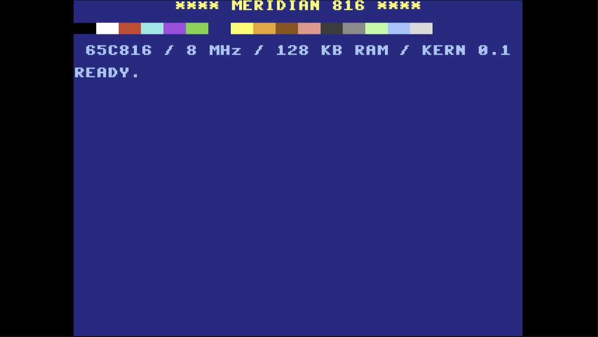

# MERIDIAN 816 for MiSTer

*A home computer that never existed — somewhere between the Commodore 64 and
the Amiga.*

MERIDIAN 816 is an original computer built as an FPGA core for the
[MiSTer](https://github.com/MiSTer-devel) (DE10-Nano). It has a 65C816 CPU and
its own graphics, sprite, sound, copper and blitter chips. It boots into
Microsoft BASIC and also has a machine-code monitor. It reads and writes disk
images, runs cartridges and can go online through the MiSTer's Linux side.

Made by [retro-modern.net](https://retro-modern.net), where you can also
read how it was built. The full technical reference with every register and
the memory map ([KONZEPT.md](KONZEPT.md)) is written in German.



## At a glance

| | |
|---|---|
| CPU | 65C816 at 8 MHz |
| Memory | 16 MB: 256 KB chip RAM + 15.7 MB expansion RAM (MiSTer SDRAM) |
| Graphics (PINSEL) | 320×240, two layers; each is text (40/80 columns), scrolling tiles, or a bitmap with 16 or 256 colours (256 out of 4096) |
| Sprites (KOBOLD) | 32 sprites of 16×16 (or 32×32 doubled), 16 colours, no per-line limit, collision detection |
| Sound (ORGEL) | 4 synth voices (ADSR, filter) + 8 sample channels, stereo; samples play straight from chip RAM or expansion RAM, up to 16 MB each; per sample channel a bit crusher, distortion and a route through the filter; an echo/delay of up to 1 s in expansion RAM; sample level against the synths adjustable (`$C544`) |
| Copper (LOTSE) / blitter (KRAN) | raster-synchronous register writes / copy, fill and transparent blits with job lists |
| Drives (TRUHE) | FAT16 disk images from the SD card, cartridges up to 4 MB, and a folder on the SD card as drive 3 |
| Network (DRAHT) | TCP, HTTP(S), file download and disk creation from BASIC, served by a small Python service on the MiSTer |
| Video | 15.7 kHz, NTSC 60 Hz or PAL 50 Hz |

## Getting started

1. Copy `releases/MERIDIAN_<date>.rbf` to `/media/fat/_Computer/` on your
   MiSTer SD card.
2. Optional: unzip `extras/MERIDIAN_disks.zip` into
   `/media/fat/games/MERIDIAN/`. It holds the demo disk `MERIDIAN.DSK`, two
   blank disks and the test cartridge `COUNTER.MOD`.
3. Start the core. It boots into BASIC with *47102 BYTES FREE*.
4. Insert a disk in the OSD under *Drive 1*. Then `DIR`, `LOAD "STARFALL"`,
   `RUN`.

The OSD also offers *Load program* (`.MER` files),
*Insert cartridge* (`.MOD`), NTSC/PAL and stereo width.

**Keyboard:** the layout is German (QWERTZ, with umlauts), as a PC or Mac
variant (OSD *Keyboard*). `Esc` stops a program, `Shift+Home` clears the
screen.

## BASIC

The BASIC is Microsoft BASIC M6502 1.1 from 1978, which Microsoft published
under the MIT license in 2025. It runs in the 65C816's 6502 emulation mode,
with programs and variables in their own 64 KB bank. MERIDIAN adds:

- **Screen:** `CLS` `COLOR` `MODE 40/80` `GRAPHIC` `PLOT` `LINE`
  `PALETTE` `GRADIENT`
- **Sprites and blitter:** `SPRITE` `PATTERN` `STAMP` `BLIT`
- **Sound:** `SOUND` `SILENCE` `SAMPLE` (channels 0–7, also straight from
  expansion RAM, e.g. `SAMPLE 0,2097152,80000`) `PLAY` (a music macro language that
  plays in the background, like `PLAY "T150 O5 L8 CEGEC<G>CE !"`)
- **Input:** `MOUSE`, `MOUSE(n)` `JOY(n)` `KEY(c)` `HIT(n)` `CLOCK(n)`
- **Drives:** `DIR` `LOAD`/`SAVE "name"` `BLOAD` `BSAVE` `SCRATCH`
  `HEADER` `DRIVE` (drives 1 and 2 are the OSD disks, `DRIVE 3` is the
  folder `games/MERIDIAN/files`, see below)
- **Network:** `NET "command"`, `NET(k)`, `NET$(k)`
- **Program flow:** `IF … THEN … ELSE`, `WHILE … WEND`, `REPEAT … UNTIL`,
  `RENUMBER [new[,step[,from]]]`
- `PEEK`/`POKE`/`WAIT` with 24-bit addresses, `PAUSE`, `MONITOR`

## Machine-code monitor

The monitor (type `MONITOR`; `X` goes back to BASIC) is in the spirit of the
C64's SMON:

- `A` assembler and `D` disassembler for the full 65C816 instruction set.
  The number of digits picks the operand size: `$12`, `$1234`, `$123456`,
  `#$12`, `#$1234`.
- `M` / `:` show and edit memory.
- `R` / `;` show and change registers.
- `G` runs a program. A `BRK` stops it in the monitor, and `G` alone carries
  on from there.
- `W` steps one instruction at a time. A small hardware assist in the core
  fires an NMI exactly one instruction after the monitor's `RTI`.
- Also: `F` fill, `T` transfer, `C` compare, `H` hunt, `L`/`S` load and save,
  `DIR`, `$ # %` to convert numbers. `?` lists everything.

## Network and folder drive (optional)

`tools/draht.py` is a small Python service for the MiSTer's Linux side. It
answers the BASIC `NET` commands through a shared window in the DDR3 memory,
and it serves the folder `/media/fat/games/MERIDIAN/files` as **drive 3**.
To install it:

1. Copy `tools/draht.py` and `tools/disk.py` to `/media/fat/linux/meridian/`.
2. Add these lines to `/media/fat/linux/user-startup.sh`:

```sh
if [ "$1" = "start" ] && [ -f /media/fat/linux/meridian/draht.py ]; then
	cd /media/fat/linux/meridian
	setsid nohup python3 -u draht.py > /tmp/draht.log 2>&1 < /dev/null &
	echo $! > /tmp/draht.pid
	cd /
fi
```

The service only works while the MERIDIAN core is loaded, and leaves other
cores alone. Example:

```basic
NET "GET wttr.in/Berlin?format=3":PRINT NET$(0):PRINT NET$(0)
```

`NET "HELP"` lists the commands: `CONNECT`, `LISTEN`, `SEND`, `CLOSE`,
`GET`, `FETCH`, `DISK`, `FILES`.

**Drive 3** is the easy way to move files between the MERIDIAN and a
computer: copy them into `games/MERIDIAN/files` (card reader, network share,
FTP), and `DRIVE 3` / `DIR` shows them right away – no disk image, no
re-inserting in the OSD. Whatever the MERIDIAN saves there is a plain file
on the SD card. Long names appear as 8.3 aliases (`Space Debris.mod` →
`SPACED~1.MOD`; type `~` with AltGr + `+`). The service creates the folder
when it starts.

```basic
DRIVE 3
DIR
BSAVE "BUFFER",2097152,1024
BLOAD "BUFFER"
```

## Example programs

`programme/` holds the demos as source and as ready-to-load `.MER`/`.BAS`
files. The file names are German.

| | |
|---|---|
| `grafik` | layers, tiles, parallax scrolling |
| `kobolde` | sprites with a joystick |
| `orgel` | the sound chip playing a tune with samples |
| `ballett` | 248 blitter objects at 60 Hz |
| `rasterbalken` | copper raster bars |
| `zusammenspiel.bas` | BASIC driving all the chips |
| `regenbogen.bas` | palette demo |
| `starfall.bas` | a small mouse/joystick game with music |
| `chat.bas` | chat over TCP (counterpart: `tools/chat.py`) |
| `guess.bas` | number guessing with `REPEAT`/`ELSE`, Collatz with `WHILE` |
| `counter.asm` | test cartridge (save data on drive 0) |
| `montest.asm` | self-test: assembles and disassembles all 256 opcodes |
| `krantest`, `dostest`, `ladetest`, `speichertest`, `zusatzdiag` | hardware tests from the build |

## Building

- **Core:** Quartus Prime Lite 17.0.2, the usual MiSTer version. Open
  `Meridian.qpf`.
- **ROMs** (kernel, BASIC, system ROM with DOS, music, network and monitor):
  `rom/bauen.sh` needs [64tass](https://tass64.sourceforge.net/) and Python 3.
  The generated `rom/*.hex` files are included, so the core builds without
  them.
- **Simulation:** Verilator. Run `make` in `sim/`, then
  `./obj_dir/meridian_sim <seconds> <outdir> 0 <frames…>`.
  `sim/nmi_test` tests the CPU core alone (NMI during IRQ entry).
- **Your own programs:** `programme/bauen.sh name` assembles to a `.MER`.
  `tools/bas.py` turns BASIC text into `.BAS`, and `tools/disk.py` creates and
  fills FAT16 disk images on a PC or Mac.

Source comments, scripts and the documentation are in German.

## Credits and licenses

- **CPU:** P65C816 by **srg320** (from
  [SNES_MiSTer](https://github.com/MiSTer-devel/SNES_MiSTer)), in the
  SystemVerilog translation by **Alan Steremberg** (Apple IIgs core), with
  three fixes for MERIDIAN (interrupt handling, see
  `rtl/cpu65c816/README.md`). GPL-3.0.
- **BASIC:** Microsoft BASIC M6502 1.1, © Microsoft Corporation, MIT license
  (`basic/quelle/`).
- **MiSTer framework** (`sys/`): GPL-2.0.
- Sound samples in the demos were made with ElevenLabs.
- **MERIDIAN 816:** © 2026 [retro-modern.net](https://retro-modern.net).
  GPL-3.0-or-later, see [LICENSE](LICENSE).
